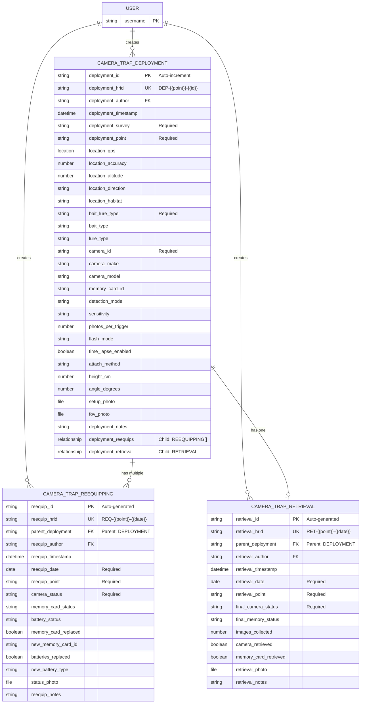

# EMSA Camera Traps Data Model Documentation

## Overview

This document describes the data model extracted from the EMSA Camera Trap Survey notebook, providing metadata for datasets collected using this system. The model consists of three primary entity types in a hierarchical parent-child relationship structure.

## Entity-Relationship Model

### Entities

#### 1. Camera Trap Deployment (Primary Entity)
**Purpose**: Documents the initial deployment of a camera trap at a specific location  
**Identifier**: `deployment-id` (auto-incremented string)  
**HRID**: Visible identifier following pattern `DEP-{{deployment-point}}-{{deployment-id}}`

##### Attributes

###### Core Identification
- `deployment-id` (String, Required): Unique auto-generated identifier
- `deployment-author` (String): Recording user (auto-populated)
- `deployment-timestamp` (Datetime): Recording timestamp (auto-populated)
- `deployment-survey` (String, Required): Survey identification
- `deployment-point` (String, Required): Deployment point identifier

###### Location Data
- `location-gps` (Location): GPS coordinates
- `location-accuracy` (Number): GPS accuracy in meters
- `location-altitude` (Number): Elevation
- `location-direction` (String): Cardinal direction camera faces
- `location-habitat` (String): Habitat type classification

###### Bait/Lure Information
- `bait-lure-type` (String, Required): Type of attractant used
- `bait-type` (String, Conditional): Specific bait used
- `bait-description` (String): Bait details
- `lure-type` (String, Conditional): Specific lure used
- `lure-description` (String): Lure details

###### Camera Information
- `camera-id` (String, Required): Camera identifier
- `camera-make` (String): Manufacturer
- `camera-model` (String): Model number
- `memory-card-id` (String): Memory card identifier
- `memory-card-capacity` (String): Storage capacity
- `battery-type` (String): Battery specification
- `battery-expiry` (Date): Battery expiration

###### Camera Settings
- `detection-mode` (String): Motion/Time-lapse/Both
- `sensitivity` (String): Detection sensitivity
- `photos-per-trigger` (Number): Burst count
- `trigger-speed` (String): Response time
- `recovery-time` (Number): Time between triggers
- `flash-mode` (String): Flash settings
- `photo-resolution` (String): Image quality
- `photo-quality` (String): Compression level

###### Time-Lapse Settings
- `time-lapse-enabled` (Boolean): Time-lapse active
- `time-lapse-interval` (String, Conditional): Interval between shots
- `time-lapse-start` (Time, Conditional): Daily start time
- `time-lapse-end` (Time, Conditional): Daily end time

###### Camera Positioning
- `attach-method` (String): Mounting method
- `height-cm` (Number): Height from ground
- `angle-degrees` (Number): Vertical angle
- `horizontal-fov` (Number): Field of view
- `distance-to-feature` (Number): Distance to target
- `visibility-obstruction` (String): Obstructions noted

###### Documentation
- `setup-photo` (File): Installation photo
- `fov-photo` (File): Field of view photo
- `deployment-notes` (String): Additional notes

###### Relationships
- `deployment-reequips` (Relationship): Links to child re-equipping records
- `deployment-retrieval` (Relationship): Links to child retrieval record

#### 2. Camera Trap Re-equipping (Child of Deployment)
**Purpose**: Documents maintenance visits to deployed cameras  
**Identifier**: Auto-generated  
**HRID**: Visible identifier following pattern `REQ-{{reequip-point}}-{{reequip-date}}`  
**Parent**: Camera Trap Deployment (many-to-one)

##### Attributes

###### Core Information
- `reequip-hrid` (String): Human-readable identifier
- `reequip-author` (String): Recording user
- `reequip-timestamp` (Datetime): Recording timestamp
- `reequip-date` (Date, Required): Visit date
- `reequip-point` (String, Required): Point identifier

###### Status Information
- `camera-status` (String, Required): Operational status
- `memory-card-status` (String): Card condition
- `battery-status` (String): Power status
- `damage-assessment` (String): Any damage noted

###### Replacement Actions
- `memory-card-replaced` (Boolean): Card changed
- `new-memory-card-id` (String, Conditional): New card ID
- `batteries-replaced` (Boolean): Batteries changed
- `new-battery-type` (String, Conditional): New battery type
- `new-battery-expiry` (Date, Conditional): New expiry date

###### Documentation
- `status-photo` (File): Current setup photo
- `reequip-notes` (String): Maintenance notes

#### 3. Camera Trap Retrieval (Child of Deployment)
**Purpose**: Documents the final retrieval of a camera trap  
**Identifier**: Auto-generated  
**HRID**: Visible identifier following pattern `RET-{{retrieval-point}}-{{retrieval-date}}`  
**Parent**: Camera Trap Deployment (one-to-one)

##### Attributes

###### Core Information
- `retrieval-hrid` (String): Human-readable identifier
- `retrieval-author` (String): Recording user
- `retrieval-timestamp` (Datetime): Recording timestamp
- `retrieval-date` (Date, Required): Retrieval date
- `retrieval-point` (String, Required): Point identifier

###### Final Status
- `final-camera-status` (String, Required): Camera condition
- `final-memory-status` (String): Memory card status
- `images-collected` (Number): Total image count
- `camera-retrieved` (Boolean): Physical retrieval
- `memory-card-retrieved` (Boolean): Card retrieval

###### Documentation
- `retrieval-photo` (File): Final site photo
- `retrieval-notes` (String): Final observations

### Relationships

#### Explicit Parent-Child Relationships
1. **Deployment → Re-equipping**: One-to-many relationship
   - Parent: Camera Trap Deployment
   - Child: Camera Trap Re-equipping
   - Multiple maintenance visits per deployment

2. **Deployment → Retrieval**: One-to-one relationship
   - Parent: Camera Trap Deployment
   - Child: Camera Trap Retrieval
   - Single retrieval per deployment

#### Other Relationships
1. **User → Records**: One-to-many via author fields
2. **Records → Files**: One-to-many via photo fields

### Data Types

| Type | Description | Example Fields |
|------|-------------|----------------|
| String | Text data | camera-id, deployment-point |
| Number | Numeric values | height-cm, images-collected |
| Date | Date only | deployment-date, battery-expiry |
| Datetime | Date and time | deployment-timestamp |
| Time | Time only | time-lapse-start |
| Location | GPS coordinates | location-gps |
| File | Binary attachments | setup-photo, fov-photo |
| Boolean | True/false | time-lapse-enabled |
| Relationship | Parent-child link | deployment-reequips |

## Data Model Diagram (Mermaid)

## Data Integrity Rules

### Required Fields

#### Deployment (6 core required)
1. deployment-id (auto-generated)
2. deployment-survey
3. deployment-point
4. bait-lure-type
5. camera-id
6. Plus GPS location

#### Re-equipping (3 required)
1. reequip-date
2. reequip-point
3. camera-status

#### Retrieval (3 required)
1. retrieval-date
2. retrieval-point
3. final-camera-status

### Conditional Logic
- Bait fields visible when bait-lure-type includes "Bait"
- Lure fields visible when bait-lure-type includes "Lure"
- Time-lapse settings visible when time-lapse-enabled = true
- Replacement fields visible when replacement actions = true

### Validation Constraints
- All required fields must be non-empty
- Dates must be valid
- Numeric fields accept appropriate ranges
- Child records can only be created from parent deployment

## Research Context

This data model supports standardized camera trap surveys for wildlife monitoring with emphasis on:

1. **Deployment tracking**: Complete documentation of setup parameters
2. **Maintenance history**: Full record of all field visits
3. **Data quality**: Standardized settings and procedures
4. **Chain of custody**: Memory card and equipment tracking
5. **Spatial analysis**: GPS-based deployment mapping
6. **Temporal coverage**: Deployment duration and maintenance intervals

## Data Capture Process

### 1. Initial Deployment
- Create new Camera Trap Deployment record
- System generates deployment-id and HRID
- Complete all deployment sections
- Document setup with photos
- Record all camera settings

### 2. Maintenance Visits (Re-equipping)
- Access deployment record
- Create child Re-equipping record from Related Records tab
- System generates HRID with date stamp
- Document status and any changes
- Multiple visits create chronological history

### 3. Final Retrieval
- Access deployment record
- Create child Retrieval record from Related Records tab
- System generates HRID with date stamp
- Document final status and image count
- Mark equipment retrieval status

## Data Export Structure

Exports maintain hierarchical structure:
- Deployments with nested re-equipping and retrieval records
- All HRIDs preserved for easy identification
- Complete maintenance history per deployment
- Photo references maintained
- GPS coordinates with accuracy metrics
- Full equipment and settings documentation

## Key Design Features

1. **Human-Readable IDs**: All entities use meaningful HRIDs incorporating location and date information
2. **Parent-Child Integrity**: Re-equipping and retrieval records explicitly linked to deployments
3. **Maintenance History**: Complete chronological record of all field visits
4. **Equipment Tracking**: Memory cards and batteries tracked through deployment lifecycle
5. **Standardized Workflows**: Consistent data capture across all deployment phases