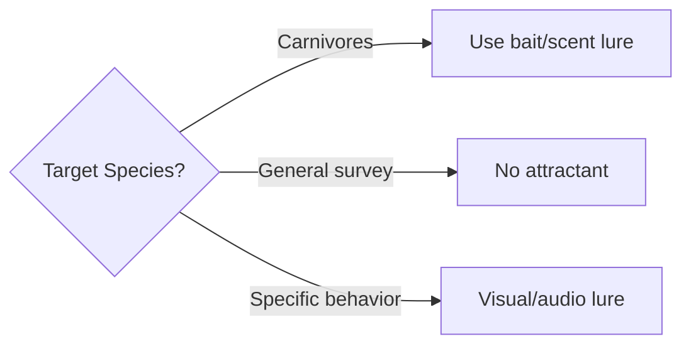
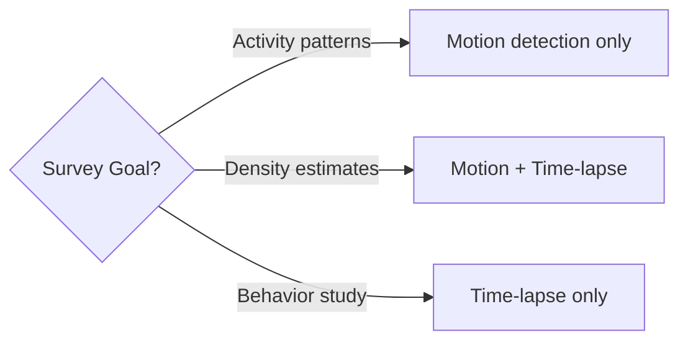
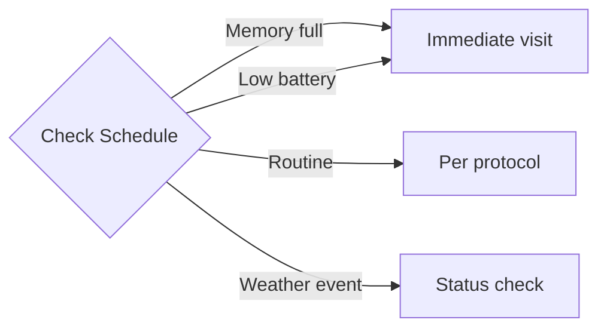

# EMSA Camera Traps Data Capture Workflow Documentation

## Overview

This document describes the data capture workflow for the EMSA Camera Trap Survey system, providing transparency about the data collection process for wildlife monitoring and research reproducibility.

## Workflow Stages

### Stage 1: Pre-Deployment Preparation
1. **Equipment Check**
   - Camera trap units tested and configured
   - Memory cards formatted and labeled
   - Batteries checked with expiry dates noted
   - GPS device ready for coordinate capture
   - Mounting equipment (straps, locks, etc.)
   - Bait/lure materials if applicable

2. **Survey Planning**
   - Survey identifier assigned
   - Deployment points selected
   - Access routes planned
   - Target species considerations

### Stage 2: Camera Trap Deployment

#### 2.1 Deployment Record Creation
1. Create new "Camera Trap Deployment" record
2. System auto-generates:
   - Unique deployment-id
   - HRID as `DEP-{{point}}-{{id}}`
   - Current user as author
   - Current timestamp

#### 2.2 Survey and Location Data
1. **Survey Tab**
   - Enter survey identifier*
   - Enter deployment point identifier*
   
2. **Point Tab**
   - Capture GPS location*
   - Record accuracy reading
   - Note altitude if available
   
3. **Location Tab**
   - Select cardinal direction camera faces
   - Document habitat type

#### 2.3 Bait/Lure Setup
1. **Bait/Lure Tab**
   - Select bait/lure type* (None/Bait/Lure/Both)
   - If using bait:
     - Specify bait type
     - Describe bait details
   - If using lure:
     - Specify lure type
     - Describe lure details

#### 2.4 Camera Configuration
1. **Camera Tab**
   - Enter camera ID*
   - Record make and model
   - Enter memory card ID
   - Note card capacity
   - Record battery type
   - Enter battery expiry date

2. **Settings1 Tab**
   - Select detection mode
   - Set sensitivity level
   - Configure photos per trigger
   - Set trigger speed
   - Configure recovery time

3. **Settings2 Tab**
   - Set flash mode
   - Select photo resolution
   - Choose photo quality

4. **Time Lapse Tab** (if applicable)
   - Enable time-lapse mode
   - Set interval
   - Configure start/end times

#### 2.5 Physical Setup
1. **Positioning Tab**
   - Document attachment method
   - Measure and record height (cm)
   - Record angle (degrees)
   - Estimate horizontal field of view
   - Measure distance to target feature
   - Note any visibility obstructions

2. **Documentation Tab**
   - Take setup photo showing installation
   - Take field of view photo from camera position
   - Add deployment notes

#### 2.6 Create Relationships
1. Navigate to **Related Records Tab**
2. Links for creating child records will be available here
3. Re-equipping records added during maintenance visits
4. Retrieval record added at end of deployment

### Stage 3: Maintenance Visits (Re-equipping)

#### 3.1 Access Parent Deployment
1. Locate deployment record using HRID
2. Navigate to Related Records tab
3. Click "Add Camera Trap Re-equipping"

#### 3.2 Re-equipping Data Capture
1. **Basic Tab**
   - System generates HRID as `REQ-{{point}}-{{date}}`
   - Enter visit date*
   - Confirm deployment point*

2. **Status Tab**
   - Assess camera status*
   - Check memory card status
   - Check battery status
   - Document any damage

3. **Replacement Tab**
   - If replacing memory card:
     - Check "Memory card replaced"
     - Enter new card ID
   - If replacing batteries:
     - Check "Batteries replaced"
     - Enter new battery type
     - Enter new expiry date

4. **Documentation Tab**
   - Take status photo
   - Add maintenance notes

### Stage 4: Camera Trap Retrieval

#### 4.1 Access Parent Deployment
1. Locate deployment record using HRID
2. Navigate to Related Records tab
3. Click "Add Camera Trap Retrieval"

#### 4.2 Retrieval Data Capture
1. **Basic Tab**
   - System generates HRID as `RET-{{point}}-{{date}}`
   - Enter retrieval date*
   - Confirm deployment point*

2. **Status Tab**
   - Record final camera status*
   - Note memory card status
   - Enter total images collected
   - Confirm camera retrieved
   - Confirm memory card retrieved

3. **Documentation Tab**
   - Take final site photo
   - Add retrieval notes

## Workflow Diagram (Mermaid)

```mermaid
flowchart TD
    Start([Survey Planning])
    
    Start --> Deploy{Deploy New<br/>Camera?}
    Deploy -->|Yes| InitDeploy[Create Deployment Record<br/>Auto: ID, HRID, User, Time]
    Deploy -->|No| Maintain{Maintenance<br/>Visit?}
    
    InitDeploy --> Survey[Survey & Point Data:<br/>- Survey ID*<br/>- Point ID*<br/>- GPS Location*]
    
    Survey --> Location[Location Details:<br/>- Direction<br/>- Habitat]
    
    Location --> BaitLure{Using Bait<br/>or Lure?}
    BaitLure -->|Yes| BaitDetails[Configure:<br/>- Type selection<br/>- Descriptions]
    BaitLure -->|No| Camera
    BaitDetails --> Camera
    
    Camera[Camera Setup:<br/>- Camera ID*<br/>- Memory Card<br/>- Batteries]
    
    Camera --> Settings[Configure Settings:<br/>- Detection mode<br/>- Sensitivity<br/>- Photos/trigger<br/>- Flash mode]
    
    Settings --> TimeLapse{Enable<br/>Time-lapse?}
    TimeLapse -->|Yes| TLSettings[Set:<br/>- Interval<br/>- Start/End times]
    TimeLapse -->|No| Position
    TLSettings --> Position
    
    Position[Physical Setup:<br/>- Mount method<br/>- Height/Angle<br/>- Field of view]
    
    Position --> Document[Documentation:<br/>- Setup photo<br/>- FOV photo<br/>- Notes]
    
    Document --> SaveDeploy[Save Deployment]
    
    SaveDeploy --> FieldWork[Active Monitoring Period]
    
    FieldWork --> Maintain
    Maintain -->|Yes| FindDeploy[Find Deployment<br/>by HRID]
    Maintain -->|No| Retrieve{Retrieve<br/>Camera?}
    
    FindDeploy --> CreateReequip[Create Re-equipping<br/>from Related Records]
    
    CreateReequip --> ReequipData[Record:<br/>- Date/Point*<br/>- Status checks*<br/>- Replacements<br/>- Photos/Notes]
    
    ReequipData --> SaveReequip[Save Re-equipping<br/>as Child Record]
    
    SaveReequip --> FieldWork
    
    Retrieve -->|Yes| FindDeployRet[Find Deployment<br/>by HRID]
    Retrieve -->|No| More{More<br/>Deployments?}
    
    FindDeployRet --> CreateRetrieval[Create Retrieval<br/>from Related Records]
    
    CreateRetrieval --> RetrievalData[Record:<br/>- Date/Point*<br/>- Final status*<br/>- Image count<br/>- Equipment retrieval]
    
    RetrievalData --> SaveRetrieval[Save Retrieval<br/>as Child Record]
    
    SaveRetrieval --> More
    More -->|Yes| Deploy
    More -->|No| End([Survey Complete])
```

## Decision Points

### 1. Bait/Lure Selection

### 2. Detection Mode

### 3. Maintenance Timing

## Data Flow

### Input Sources
1. **Automated**
   - Deployment ID (system generated)
   - HRIDs (template generated)
   - Author (from user context)
   - Timestamp (system time)
   - GPS coordinates (device GPS)

2. **Manual Entry**
   - Survey/point identifiers
   - Equipment IDs and settings
   - Physical measurements
   - Status assessments
   - Photos

3. **Conditional Fields**
   - Bait/lure details (based on type selection)
   - Time-lapse settings (if enabled)
   - Replacement details (if applicable)

### Output Format
- Hierarchical JSON with parent-child relationships
- Deployment records containing all settings
- Chronological maintenance history
- Complete retrieval documentation
- All records identified by HRIDs

## Quality Control Mechanisms

### 1. Validation Rules
- Required fields enforced at each stage
- Conditional logic guides data entry
- Parent-child relationships prevent orphaned records

### 2. Data Integrity
- HRIDs ensure unique identification
- Chronological maintenance tracking
- Equipment ID consistency
- Complete deployment lifecycle

### 3. Documentation Standards
- Photos at each stage
- Standardized status codes
- Consistent measurement units
- Detailed notes fields

## Workflow Variations

### Scenario 1: Standard Deployment
- Full deployment setup
- Monthly maintenance visits
- Standard 3-month deployment
- Complete retrieval

### Scenario 2: Extended Deployment
- Initial deployment
- Multiple re-equipping visits
- Battery/card replacements
- Extended monitoring period

### Scenario 3: Problem Resolution
- Deployment with issues
- Damage assessment visit
- Equipment replacement
- Continued monitoring

### Scenario 4: Early Retrieval
- Standard deployment
- Environmental/access issues
- Early retrieval decision
- Complete documentation

## Temporal Aspects

### Time per Record
- Initial deployment: 20-30 minutes
- Re-equipping visit: 10-15 minutes
- Final retrieval: 15-20 minutes

### Deployment Duration
- Standard: 3-6 months
- Extended: 6-12 months
- Maintenance interval: 4-6 weeks

## Research Integrity Features

### 1. Complete Documentation
- Every deployment fully documented
- All maintenance visits recorded
- Equipment history maintained
- Settings preserved for analysis

### 2. Traceability
- Parent-child relationships explicit
- Chronological history preserved
- User attribution on all records
- Timestamp documentation

### 3. Standardization
- Consistent data collection
- Controlled vocabularies
- Required field enforcement
- Systematic workflow progression

### 4. Equipment Tracking
- Camera IDs throughout deployment
- Memory card chain of custody
- Battery management records
- Failure documentation

## Data Summary

### Per Deployment
- 1 deployment record (parent)
- 0-many re-equipping records (children)
- 0-1 retrieval record (child)
- Complete settings documentation
- Full maintenance history
- Equipment tracking

### Survey Overview
- Multiple deployments per survey
- Hierarchical data structure
- GPS-mapped deployment network
- Temporal coverage analysis
- Equipment utilization tracking

This workflow ensures systematic, reproducible camera trap surveys with complete documentation of the deployment lifecycle, maintenance history, and data quality indicators.