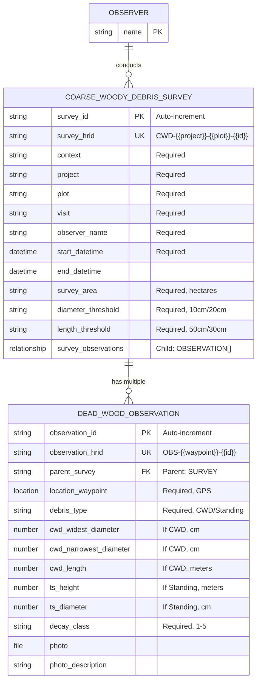

# EMSA Coarse Woody Debris Data Model Documentation

## Overview

This document describes the data model extracted from the EMSA Coarse Woody Debris Survey notebook, providing metadata for datasets collected using this system. The model consists of two primary entity types in a hierarchical parent-child relationship structure.

## Entity-Relationship Model

### Entities

#### 1. Coarse Woody Debris Survey (Parent Entity)
**Purpose**: Documents survey metadata and parameters for coarse woody debris assessment  
**Identifier**: `survey-id` (auto-incremented string)  
**HRID**: Visible identifier following pattern `CWD-{{project}}-{{plot}}-{{survey-id}}`

##### Attributes

###### Core Identification
- `survey-id` (String): Unique auto-generated identifier
- `survey-hrid` (String): Human-readable identifier
- `context` (String, Required): Survey context
- `project` (String, Required): Project name
- `plot` (String, Required): Plot identifier
- `visit` (String, Required): Visit number or identifier
- `observer-name` (String, Required): Observer's name

###### Timing Information
- `start-datetime` (DateTime, Required): Survey start date and time
- `end-datetime` (DateTime): Survey end date and time

###### Survey Parameters
- `survey-area` (String, Required): Area surveyed (hectares)
- `diameter-threshold` (String, Required): Minimum diameter threshold (10cm or 20cm)
- `length-threshold` (String, Required): Minimum length threshold (50cm or 30cm)

###### Relationships
- `survey-observations` (Relationship): Links to child dead wood observation records

#### 2. Dead Wood Observation (Child of Survey)
**Purpose**: Documents individual pieces of coarse woody debris or standing dead trees  
**Identifier**: `observation-id` (auto-incremented string)  
**HRID**: Visible identifier following pattern `OBS-{{location-waypoint}}-{{observation-id}}`  
**Parent**: Coarse Woody Debris Survey (many-to-one)

##### Attributes

###### Core Information
- `observation-id` (String): Unique auto-generated identifier
- `observation-hrid` (String): Human-readable identifier
- `location-waypoint` (Location, Required): GPS coordinates of debris
- `debris-type` (String, Required): Type classification (Coarse Woody Debris/Standing Dead Tree)

###### Measurements - Coarse Woody Debris
- `cwd-widest-diameter` (Number, Conditional): Widest diameter in cm
- `cwd-narrowest-diameter` (Number, Conditional): Narrowest diameter in cm
- `cwd-length` (Number, Conditional): Length in meters

###### Measurements - Standing Dead Tree
- `ts-height` (Number, Conditional): Tree height in meters
- `ts-diameter` (Number, Conditional): Diameter at breast height in cm

###### Common Attributes
- `decay-class` (String, Required): Decay classification (1-5)

###### Documentation
- `photo` (File): Photograph of debris
- `photo-description` (String): Photo description/notes

### Relationships

#### Explicit Parent-Child Relationships
1. **Survey → Observations**: One-to-many relationship
   - Parent: Coarse Woody Debris Survey
   - Child: Dead Wood Observation
   - Multiple observations per survey
   - Child records created from parent's Related Records tab

#### Other Relationships
1. **Observer → Survey**: One-to-many via observer-name field
2. **Records → Files**: One-to-one via photo field

### Data Types

| Type | Description | Example Fields |
|------|-------------|----------------|
| String | Text data | project, plot, decay-class |
| Number | Numeric values | cwd-length, ts-height |
| DateTime | Date and time | start-datetime, end-datetime |
| Location | GPS coordinates | location-waypoint |
| File | Binary attachments | photo |
| Relationship | Parent-child link | survey-observations |

### Controlled Vocabularies

#### Diameter Threshold
- 10 cm
- 20 cm

#### Length Threshold
- 50 cm
- 30 cm

#### Debris Type
- Coarse Woody Debris
- Standing Dead Tree

#### Decay Class (1-5 scale)
- 1: Recently dead, bark intact
- 2: Bark loosening, wood sound
- 3: Bark mostly gone, wood softening
- 4: Wood soft throughout
- 5: Very decomposed, outline only

## Data Model Diagram (Mermaid)

## Data Integrity Rules

### Required Fields

#### Survey (11 required)
1. survey-id (auto-generated)
2. context
3. project
4. plot
5. visit
6. observer-name
7. start-datetime
8. survey-area
9. diameter-threshold
10. length-threshold

#### Observation (4 required + conditionals)
1. observation-id (auto-generated)
2. location-waypoint
3. debris-type
4. decay-class
5. Plus type-specific measurements

### Conditional Logic
- CWD measurements visible when debris-type = "Coarse Woody Debris"
- Standing tree measurements visible when debris-type = "Standing Dead Tree"
- At least one measurement required based on type

### Validation Constraints
- All required fields must be non-empty
- Numeric measurements must be positive
- Decay class must be 1-5
- Child observations can only be created from parent survey

## Research Context

This data model supports standardized assessment of coarse woody debris for:

1. **Carbon storage estimation**: Volume calculations from dimensions
2. **Habitat assessment**: Decay class indicates wildlife value
3. **Forest health monitoring**: Dead wood as ecosystem indicator
4. **Fire fuel load assessment**: Volume and decay state
5. **Temporal change detection**: Repeat visit comparisons

## Data Capture Process

### 1. Survey Setup
- Create new Coarse Woody Debris Survey record
- System generates survey-id and HRID
- Enter project, plot, and visit information
- Record observer and timing
- Define survey parameters (thresholds)

### 2. Observation Recording
- From survey record, navigate to Related Records tab
- Create child Dead Wood Observation records
- System generates observation-id and HRID
- Capture GPS location for each piece
- Select type and record appropriate measurements
- Document decay class
- Optional photo documentation

### 3. Data Completion
- All observations linked to parent survey
- Complete survey end time
- Review all child observations
- Validate threshold compliance

## Data Export Structure

Exports maintain hierarchical structure:
- Survey records with nested observations
- All HRIDs preserved for identification
- Complete measurement data
- GPS coordinates for spatial analysis
- Photo references maintained
- Parent-child relationships explicit

## Key Design Features

1. **Human-Readable IDs**: Both entities use meaningful HRIDs incorporating project/plot/location information
2. **Parent-Child Integrity**: Observations explicitly linked to surveys, preventing orphaned records
3. **Flexible Measurements**: Conditional fields adapt to debris type
4. **Standardized Thresholds**: Consistent size criteria across surveys
5. **Spatial Documentation**: GPS location for every observation
6. **Decay Classification**: Standardized 5-point scale for consistency

## Quality Control Mechanisms

### 1. Threshold Enforcement
- Survey parameters define minimum sizes
- Observers reference during data collection
- Ensures consistent sampling

### 2. Type-Specific Validation
- Appropriate measurements for each debris type
- Prevents incorrect data entry
- Maintains data logic

### 3. Parent-Child Structure
- All observations traceable to survey
- Survey metadata applies to all children
- Prevents isolated records

### 4. Location Accuracy
- GPS required for each observation
- Enables spatial analysis
- Supports repeat sampling

This data model ensures systematic, reproducible assessment of coarse woody debris with clear relationships between survey metadata and individual observations.