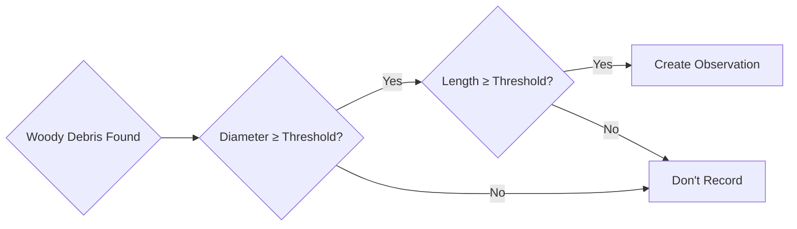
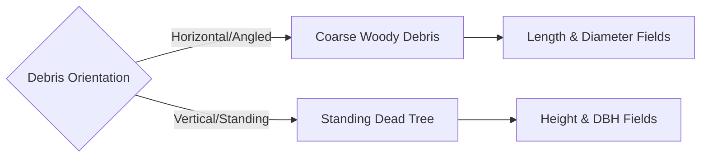
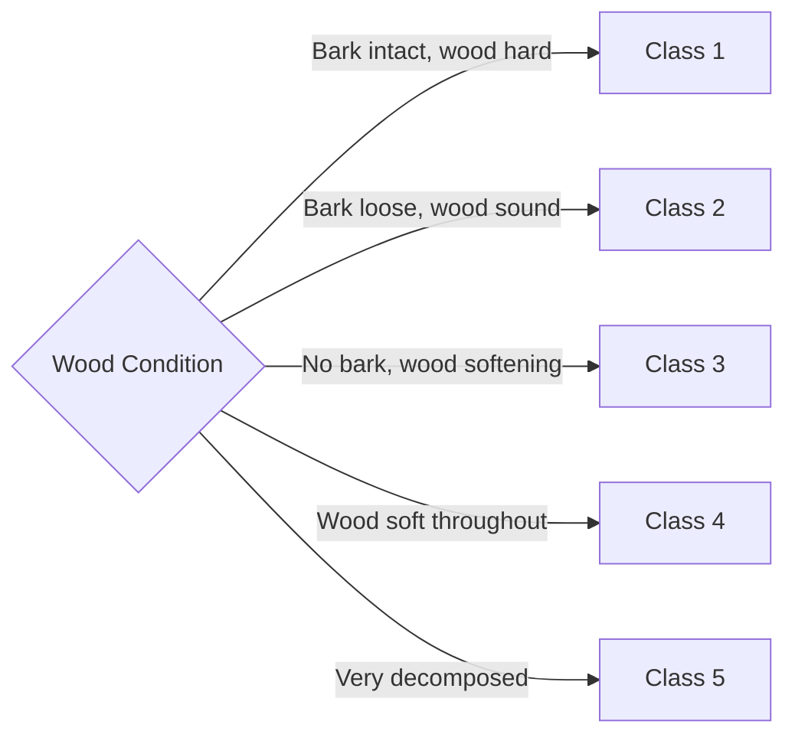

# EMSA Coarse Woody Debris Data Capture Workflow Documentation

## Overview

This document describes the data capture workflow for the EMSA Coarse Woody Debris Survey system, providing transparency about the data collection process for ecological monitoring and research reproducibility.

## Workflow Stages

### Stage 1: Pre-Survey Preparation
1. **Equipment Check**
   - Mobile device with FAIMS3 app
   - GPS enabled and tested
   - Camera for photo documentation
   - Measuring tape (≥10m)
   - Diameter tape or calipers
   - Clinometer/hypsometer for tree heights
   - Reference guide for decay classes

2. **Survey Planning**
   - Project and plot identifiers defined
   - Visit number assigned
   - Survey area boundaries established
   - Minimum size thresholds determined

### Stage 2: Survey Setup

#### 2.1 Create Survey Record
1. Open notebook and select "Coarse Woody Debris Survey"
2. System auto-generates:
   - Unique survey-id
   - HRID as `CWD-{{project}}-{{plot}}-{{id}}`

#### 2.2 Complete Survey Details
1. **Survey Details Tab**
   - View auto-generated IDs
   - Enter context* (survey purpose)
   - Enter project name*
   - Enter plot identifier*
   - Enter visit number*
   - Enter observer name*

2. **Survey Timing Tab**
   - Enter start date/time*
   - End time completed after survey

3. **Survey Parameters Tab**
   - Enter survey area* (hectares)
   - Select diameter threshold* (10cm or 20cm)
   - Select length threshold* (50cm or 30cm)

#### 2.3 Save Survey Record
- Review all required fields
- Save survey to enable observations
- Navigate to Related Records tab

### Stage 3: Field Data Collection

#### 3.1 Systematic Search
1. Walk systematic transects through survey area
2. Identify qualifying woody debris:
   - Coarse woody debris meeting size thresholds
   - Standing dead trees meeting diameter threshold

#### 3.2 For Each Qualifying Piece

##### Create Observation Record
1. From Survey's Related Records tab
2. Click "Add Dead Wood Observation"
3. System generates:
   - Observation-id
   - HRID as `OBS-{{waypoint}}-{{id}}`
   - Parent-child link to survey

##### Basic Information Tab
1. View auto-generated IDs
2. Capture GPS location* at debris
3. Select debris type*:
   - Coarse Woody Debris
   - Standing Dead Tree

##### Measurements Tab (Type-Specific)

**For Coarse Woody Debris:**
1. Measure widest diameter (cm)
2. Measure narrowest diameter (cm)
3. Measure total length (m)
4. Assess decay class* (1-5)

**For Standing Dead Tree:**
1. Measure/estimate height (m)
2. Measure DBH (cm)
3. Assess decay class* (1-5)

##### Documentation Tab
1. Take photograph (optional)
2. Add photo description/notes

##### Save Observation
1. Review required fields
2. Save observation
3. Continue to next piece

### Stage 4: Survey Completion

#### 4.1 Final Survey Updates
1. Return to parent survey record
2. Navigate to Survey Timing tab
3. Enter end date/time
4. Save survey

#### 4.2 Data Review
1. Check Related Records tab
2. Verify all observations present
3. Review observation count
4. Confirm GPS coverage

## Workflow Diagram (Mermaid)

```mermaid
flowchart TD
    Start([Survey Planning])
    
    Start --> CreateSurvey[Create Survey Record<br/>Auto: ID, HRID]
    
    CreateSurvey --> Details[Survey Details:<br/>- Context*<br/>- Project*<br/>- Plot*<br/>- Visit*<br/>- Observer*]
    
    Details --> Timing[Survey Timing:<br/>- Start time*<br/>- End time (later)]
    
    Timing --> Parameters[Survey Parameters:<br/>- Area (ha)*<br/>- Diameter threshold*<br/>- Length threshold*]
    
    Parameters --> SaveSurvey[Save Survey]
    
    SaveSurvey --> BeginField[Begin Field Work]
    
    BeginField --> SearchArea{Find<br/>Debris?}
    
    SearchArea -->|No| MoreArea{More<br/>Area?}
    SearchArea -->|Yes| CheckSize{Meets<br/>Thresholds?}
    
    CheckSize -->|No| MoreArea
    CheckSize -->|Yes| CreateObs[Create Observation<br/>from Related Records]
    
    CreateObs --> BasicInfo[Basic Info:<br/>- GPS location*<br/>- Debris type*]
    
    BasicInfo --> DebrisType{Type?}
    
    DebrisType -->|CWD| CWDMeasure[Measure:<br/>- Widest diameter<br/>- Narrowest diameter<br/>- Length<br/>- Decay class*]
    
    DebrisType -->|Standing| TreeMeasure[Measure:<br/>- Height<br/>- DBH<br/>- Decay class*]
    
    CWDMeasure --> Photo{Take<br/>Photo?}
    TreeMeasure --> Photo
    
    Photo -->|Yes| AddPhoto[Capture Photo<br/>Add Description]
    Photo -->|No| SaveObs
    AddPhoto --> SaveObs[Save Observation]
    
    SaveObs --> MoreArea
    
    MoreArea -->|Yes| SearchArea
    MoreArea -->|No| EndSurvey[Return to Survey<br/>Add End Time]
    
    EndSurvey --> Complete([Survey Complete])
```

## Decision Points

### 1. Size Threshold Assessment


### 2. Debris Type Selection


### 3. Decay Class Assignment


## Data Flow

### Input Sources
1. **Automated**
   - Survey/Observation IDs
   - HRIDs (template generated)
   - GPS coordinates
   - Parent-child relationships

2. **Manual Entry**
   - Project/plot/visit identifiers
   - Observer information
   - Physical measurements
   - Decay assessment
   - Photos

3. **Survey Parameters**
   - Area coverage
   - Size thresholds
   - Time boundaries

### Output Format
- Hierarchical JSON with parent-child structure
- Survey containing all observations
- Complete measurement data
- Spatial coordinates for mapping
- Photo documentation

## Quality Control Mechanisms

### 1. Threshold Enforcement
- Survey parameters define minimums
- Consistent application across plot
- Documented for reproducibility

### 2. Required Fields
- GPS location for every observation
- Debris type classification
- Decay class assessment
- Type-appropriate measurements

### 3. Parent-Child Integrity
- Observations only created from survey
- Automatic relationship maintenance
- No orphaned records possible

### 4. Data Validation
- Positive numeric values only
- Decay class 1-5 range
- Required fields enforced

## Workflow Variations

### Scenario 1: Small Plot Survey
- Limited area (<0.5 ha)
- Complete census possible
- 30-60 minutes duration
- 10-30 observations typical

### Scenario 2: Large Plot Survey
- Extensive area (>1 ha)
- Transect sampling
- 2-4 hours duration
- 50-100+ observations

### Scenario 3: Repeat Visit
- Same plot, new visit number
- Change detection focus
- Compare to previous surveys
- Note missing/new pieces

### Scenario 4: Post-Disturbance
- Fire/storm assessment
- Modified thresholds possible
- Safety considerations
- Extensive documentation

## Temporal Aspects

### Time per Observation
- Simple CWD: 2-3 minutes
- Complex/large CWD: 4-5 minutes
- Standing dead tree: 3-4 minutes
- With photography: +1-2 minutes

### Survey Duration
- Setup: 5-10 minutes
- Field time: 1-4 hours (area dependent)
- Completion: 5 minutes

### Efficiency Factors
- Debris density
- Terrain difficulty
- Measurement complexity
- Team size (if multiple observers)

## Research Integrity Features

### 1. Standardization
- Defined size thresholds
- Consistent decay classification
- Systematic search patterns
- Complete GPS coverage

### 2. Traceability
- Every observation linked to survey
- Survey metadata preserved
- Observer attribution
- Temporal boundaries

### 3. Reproducibility
- Documented parameters
- Spatial coordinates
- Photographic record
- Hierarchical data structure

### 4. Quality Indicators
- Observation count
- Spatial distribution
- Size class representation
- Decay class distribution

## Best Practices

### Field Efficiency
1. **Systematic Coverage**: Use parallel transects
2. **Team Coordination**: Assign search areas
3. **Measurement Order**: Consistent sequence
4. **Batch Photography**: If documenting all pieces

### Data Quality
1. **GPS Accuracy**: Wait for good signal
2. **Measurement Precision**: Use appropriate tools
3. **Decay Assessment**: Reference guide/photos
4. **Complete Records**: All required fields

### Safety Considerations
1. **Terrain Hazards**: Watch for unstable debris
2. **Wildlife**: Be aware of habitat use
3. **Weather**: Avoid during storms
4. **Equipment**: Proper PPE as needed

## Data Summary

### Per Survey
- 1 parent survey record
- Multiple observation children
- Complete parameter documentation
- Defined spatial/temporal bounds

### Per Observation  
- Unique location
- Type-specific measurements
- Decay classification
- Optional photo
- Parent survey reference

### Analysis Ready
- Volume calculations possible
- Spatial distribution mapping
- Decay class summaries
- Temporal comparisons
- Carbon storage estimates

This workflow ensures systematic, reproducible assessment of coarse woody debris with hierarchical data organization and complete documentation of survey parameters and individual observations.