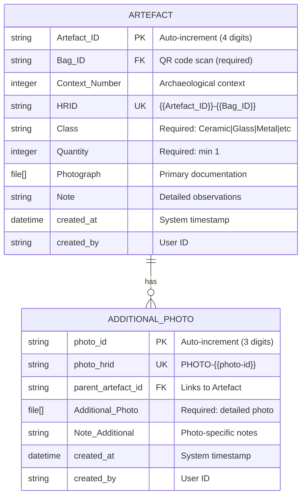

# Archaeological Historical Artefact Recording - Data Model

## Entity-Relationship Diagram



## Data Structure

### Primary Entities

#### 1. Artefact (Parent Record)
The main recording unit for archaeological finds.

**Key Attributes:**
- **Artefact_ID**: System-generated sequential identifier (0001-9999)
- **Bag_ID**: QR code from physical artefact bag (external reference)
- **HRID**: Composite human-readable ID combining Artefact_ID and Bag_ID
- **Class**: Controlled vocabulary for artefact types
- **Quantity**: Numeric count of items in bag

**Relationships:**
- Can have zero to many Additional_Photo records
- Each artefact exists independently

#### 2. Additional_Photo (Child Record)
Detailed photographic documentation linked to specific artefacts.

**Key Attributes:**
- **photo_id**: System-generated sequential identifier (001-999)
- **photo_hrid**: Human-readable photo reference
- **parent_artefact_id**: Foreign key to parent Artefact record
- **Additional_Photo**: Required photo attachment

**Relationships:**
- Must belong to exactly one Artefact record
- Cannot exist without parent

## Field Classifications

### Identifiers
- **Primary Keys**: Artefact_ID, photo_id
- **Foreign Keys**: Bag_ID (external), parent_artefact_id
- **Unique Keys**: HRID, photo_hrid

### Required Fields
- Artefact: Bag_ID, Class, Quantity
- Additional_Photo: Additional_Photo (file)

### Optional Fields
- Context_Number
- All Note fields
- Primary Photograph on Artefact

### Controlled Vocabularies
```
Class:
- Ceramic
- Glass  
- Metal
- Miscellaneous
- Faunal
- Organic
- Building Materials
```

## Data Relationships

### Parent-Child Hierarchy
```
Artefact (Parent)
    ├── Additional_Photo 1 (Child)
    ├── Additional_Photo 2 (Child)
    └── Additional_Photo n (Child)
```

### Cardinality
- One Artefact can have zero to many Additional Photos
- One Additional Photo must belong to exactly one Artefact
- Relationship type: One-to-Many (1:N)

## Data Integrity Rules

### Validation Rules
1. **Artefact_ID**: Auto-generated, unique, 4 digits
2. **Bag_ID**: Must be valid QR code format
3. **Quantity**: Integer ≥ 1
4. **Class**: Must be from controlled vocabulary
5. **photo_id**: Auto-generated, unique, 3 digits
6. **Photos**: Valid image file formats

### Referential Integrity
- Additional_Photo records cannot exist without parent Artefact
- Deleting Artefact should cascade delete all child photos
- Parent reference must be valid Artefact HRID

### Business Rules
1. HRID generated automatically from components
2. Additional Photos can only be created from parent record
3. Each bag should have unique QR code
4. Quantity defaults to 1 if not specified

## Data Flow

### Creation Sequence
1. Create Artefact record
   - Generate Artefact_ID
   - Scan/enter Bag_ID
   - Calculate HRID
   - Set required fields
2. Add Additional Photos (optional)
   - Generate photo_id
   - Link to parent Artefact
   - Calculate photo_hrid
   - Upload photo file

### Query Patterns
- Find artefacts by Bag_ID (QR lookup)
- List artefacts by Context_Number
- Search by Class type
- Retrieve all photos for an artefact
- Export complete hierarchy

## Storage Considerations

### Data Types
- **Strings**: IDs, classifications, notes
- **Integers**: Quantity, Context_Number
- **Files**: Photo attachments (JPEG, PNG)
- **Timestamps**: Creation/modification tracking
- **Arrays**: Photo file collections

### Indexing Strategy
- Primary index on Artefact_ID
- Unique index on HRID
- Index on Bag_ID for QR lookups
- Index on Context_Number for queries
- Index on Class for filtering
- Foreign key index on parent_artefact_id

## Export Schema

### JSON Structure
```json
{
  "artefact": {
    "Artefact_ID": "0001",
    "Bag_ID": "BAG123",
    "HRID": "0001-BAG123",
    "Context_Number": 150,
    "Class": "Ceramic",
    "Quantity": 5,
    "Photograph": ["photo1.jpg"],
    "Note": "Rim sherds, decorated",
    "additional_photos": [
      {
        "photo_id": "001",
        "photo_hrid": "PHOTO-001",
        "Additional_Photo": ["detail1.jpg"],
        "Note_Additional": "Maker's mark visible"
      }
    ]
  }
}
```

### CSV Flattened Structure
```csv
Artefact_ID,Bag_ID,HRID,Context_Number,Class,Quantity,Note,Photo_Count
0001,BAG123,0001-BAG123,150,Ceramic,5,"Rim sherds, decorated",2
```

## Security and Access

### Field-Level Permissions
- All fields: Read/Write for team members
- System fields: Read-only (IDs, timestamps)
- QR codes: Scan permission required

### Record-Level Access
- Create: Team members and above
- Read: All project participants  
- Update: Creator and moderators
- Delete: Moderators and admins only

This data model ensures robust archaeological documentation while maintaining flexibility for various recording scenarios and analytical requirements.