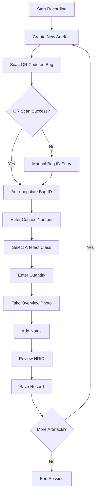
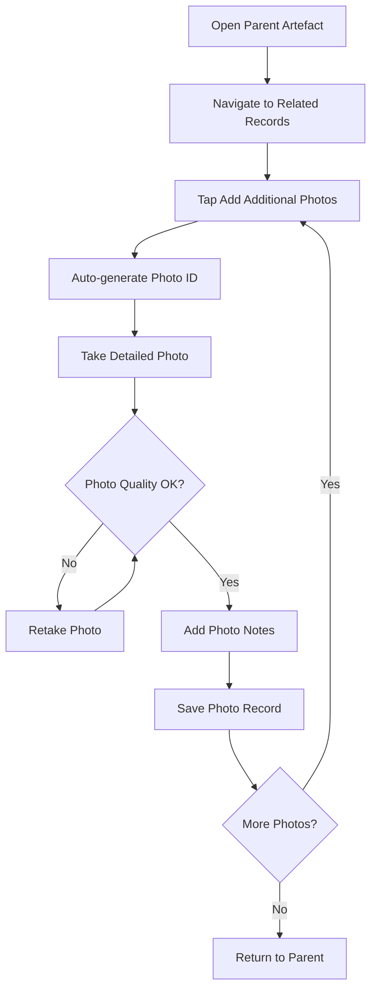
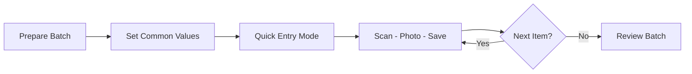
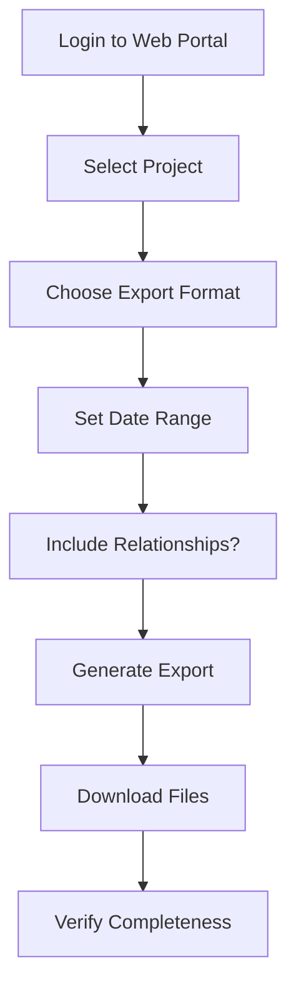

# Archaeological Historical Artefact Recording - Workflow Guide

## Overview
This guide outlines the step-by-step workflows for recording archaeological artefacts using the FAIMS3 notebook, from initial field recording through detailed photographic documentation.

## Table of Contents
1. [Pre-Recording Setup](#pre-recording-setup)
2. [Basic Artefact Recording](#basic-artefact-recording)
3. [Adding Detailed Photos](#adding-detailed-photos)
4. [Batch Processing](#batch-processing)
5. [Quality Control](#quality-control)
6. [Data Export](#data-export)

## Pre-Recording Setup

### Equipment Checklist
- [ ] Mobile device with FAIMS3 app
- [ ] QR code scanner enabled
- [ ] Camera functioning properly
- [ ] Adequate storage space
- [ ] Pre-printed QR code bags
- [ ] Context recording sheets
- [ ] Photo scales and north arrows

### Project Configuration
1. Ensure notebook is loaded and synced
2. Verify user permissions
3. Test QR code scanning
4. Check photo capture functionality
5. Confirm auto-increment counters

## Basic Artefact Recording

### Workflow Diagram


### Step-by-Step Instructions

#### 1. Start New Artefact Record
- Open FAIMS3 app
- Navigate to "Archaeological Historical Artefact Recording"
- Tap "Create New Record"
- Select "Artefact" form

#### 2. Basic Information Tab
1. **Artefact ID**: Auto-generated (note for reference)
2. **Bag ID**: 
   - Position QR code in scanner frame
   - Wait for successful scan beep
   - Verify correct code displayed
3. **Context Number**: 
   - Enter archaeological context
   - Use numeric keypad
   - Leave blank if unknown
4. **HRID**: 
   - Automatically generated
   - Format: `[Artefact_ID]-[Bag_ID]`
   - Example: "0001-BAG123"

#### 3. Count & Details Tab
1. **Class Selection**:
   ```
   Available Options:
   - Ceramic (pottery, tiles)
   - Glass (bottles, windows)
   - Metal (iron, copper, lead)
   - Miscellaneous (composite objects)
   - Faunal (bones, shells)
   - Organic (wood, leather, textile)
   - Building Materials (brick, mortar)
   ```
2. **Quantity**:
   - Enter total count
   - Default is 1
   - Include fragments in count
3. **Photograph**:
   - Arrange artefacts with scale
   - Ensure good lighting
   - Include bag label in frame
   - Take photo
   - Review quality
4. **Notes**:
   - Describe key features
   - Note condition
   - Record preliminary observations

#### 4. Save Record
- Review all fields
- Tap "Save" button
- Wait for confirmation
- Note HRID for future reference

## Adding Detailed Photos

### When to Add Detail Photos
- Diagnostic features (maker's marks, decoration)
- Multiple views needed
- Close-ups of specific elements
- Conservation documentation
- Comparison shots

### Workflow Diagram


### Step-by-Step Instructions

#### 1. Access Parent Record
- Use search or browse function
- Find artefact by HRID or Bag ID
- Open record for editing

#### 2. Navigate to Related Records
- Swipe to "Related Records" tab
- View existing photos (if any)
- Tap "Add Additional Photos" button

#### 3. Create Photo Record
1. **Photo ID**: Auto-generated (note number)
2. **Photo Record ID**: Auto-generated HRID
3. **Take Photo**:
   - Focus on specific detail
   - Use macro mode if available
   - Include scale if needed
   - Ensure sharp focus
4. **Add Notes**:
   - Describe what photo shows
   - Note angle/orientation
   - Highlight specific features

#### 4. Save and Continue
- Save photo record
- System returns to parent
- Add more photos as needed

## Batch Processing

### Efficient Recording Strategies

#### Context-Based Batches
1. Sort bags by context before recording
2. Process all bags from same context together
3. Speeds up context number entry
4. Maintains recording consistency

#### Class-Based Batches
1. Group similar artefact types
2. Reduces classification decision time
3. Enables comparative recording
4. Improves consistency

### Rapid Entry Workflow


### Tips for Speed
1. Pre-sort artefacts by type/context
2. Set up photo station with fixed scale
3. Use consistent photo angles
4. Keep notes brief but informative
5. Add detailed photos in second pass

## Quality Control

### Field Validation Checklist
- [ ] All required fields completed
- [ ] QR codes correctly scanned
- [ ] Photos clear and properly lit
- [ ] Quantities reasonable
- [ ] Classifications appropriate
- [ ] Context numbers valid

### Common Errors and Solutions

#### QR Code Issues
**Problem**: Code won't scan
**Solutions**:
- Clean camera lens
- Improve lighting
- Smooth out bag wrinkles
- Try different angles
- Use manual entry

#### Photo Problems
**Problem**: Blurry or dark photos
**Solutions**:
- Tap to focus before capture
- Use additional lighting
- Steady device on surface
- Clean camera lens
- Check storage space

#### Data Entry Errors
**Problem**: Wrong class selected
**Solutions**:
- Edit record immediately
- Add clarification in notes
- Consult reference guide
- Ask supervisor if uncertain

### Daily Review Process
1. **End of Day Check**:
   - Review day's entries
   - Check photo quality
   - Verify context numbers
   - Look for missing data

2. **Sync Data**:
   - Connect to internet
   - Run sync process
   - Verify upload success
   - Check for conflicts

## Data Export

### Export Preparation
1. Ensure all records synced
2. Review for completeness
3. Add any final notes
4. Verify relationships intact

### Export Formats

#### For Analysis
- **CSV Format**: Quantitative analysis
- **JSON Format**: Complete relationships
- **Photo Package**: All images with metadata

#### For Reporting
- **Summary Statistics**: By class and context
- **Photo Catalogue**: Visual reference
- **Finds Register**: Formal documentation

### Export Workflow


## Best Practices Summary

### Do's
- ✓ Always scan QR codes when possible
- ✓ Take clear, well-lit photos
- ✓ Complete all required fields
- ✓ Add notes for unusual items
- ✓ Sync data regularly
- ✓ Review entries before syncing
- ✓ Use consistent terminology

### Don'ts
- ✗ Skip required fields
- ✗ Use flash for reflective objects
- ✗ Forget to include scales
- ✗ Leave ambiguous classifications
- ✗ Work offline for extended periods
- ✗ Delete records without consultation

## Troubleshooting Quick Reference

| Issue | Quick Fix | Long-term Solution |
|-------|-----------|-------------------|
| App crashes | Restart app | Update to latest version |
| Sync fails | Check internet | Contact admin |
| Photos missing | Check storage | Clear app cache |
| QR won't scan | Manual entry | Replace damaged codes |
| Wrong counter | Note in comments | Reset counter (admin) |

## Support Resources

### In-Field Support
- Supervisor contact: [Available on site]
- Technical support: [IT helpdesk]
- Reference materials: [Field manual]

### Training Resources
- Video tutorials: [Project portal]
- Practice dataset: [Training mode]
- FAQ document: [Shared drive]

This workflow guide ensures consistent, high-quality archaeological documentation while maximizing recording efficiency in field conditions.