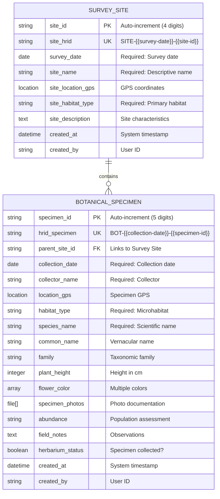

# Botanical Collection - Data Model

## Entity-Relationship Diagram



## Data Structure

### Primary Entities

#### 1. Survey Site (Parent Record)
The top-level organizational unit representing a botanical survey location.

**Key Attributes:**
- **site_id**: System-generated sequential identifier (0001-9999)
- **site_hrid**: Human-readable site reference combining date and ID
- **survey_date**: Date of botanical survey
- **site_name**: Descriptive location identifier
- **site_location_gps**: Central GPS coordinates with accuracy metadata

**Relationships:**
- Can have zero to many Botanical Specimen records
- Exists independently of specimens
- Provides environmental context for all child specimens

#### 2. Botanical Specimen (Child Record)
Individual plant specimen documentation linked to a survey site.

**Key Attributes:**
- **specimen_id**: System-generated sequential identifier (00001-99999)
- **hrid_specimen**: Human-readable specimen number
- **parent_site_id**: Foreign key to parent Survey Site
- **species_name**: Scientific binomial nomenclature
- **location_gps**: Specific specimen coordinates (may differ from site)

**Relationships:**
- Must belong to exactly one Survey Site
- Cannot exist without parent site
- Inherits site-level environmental context

## Field Classifications

### Identifiers
- **Primary Keys**: site_id, specimen_id
- **Foreign Keys**: parent_site_id
- **Unique Keys**: site_hrid, hrid_specimen

### Required Fields
- **Survey Site**: survey_date, site_name, site_habitat_type
- **Specimen**: collection_date, collector_name, habitat_type, species_name

### Optional Fields
- GPS locations (though strongly recommended)
- Common names and family
- Morphological measurements
- Photographs
- Abundance assessments
- Field notes

### Controlled Vocabularies

#### Habitat Types (Both Levels)
```
- forest
- grassland
- wetland
- coastal
- alpine
- desert
- urban
- agricultural
- other
```

#### Abundance Categories
```
- rare (1-2 individuals)
- uncommon (3-10 individuals)
- common (11-100 individuals)
- abundant (>100 individuals)
```

#### Flower Colors
```
- white
- yellow
- orange
- red
- pink
- purple
- blue
- green
- brown
- black
```

## Data Relationships

### Hierarchical Structure
```
Survey Site (Parent)
    ├── Botanical Specimen 1 (Child)
    ├── Botanical Specimen 2 (Child)
    ├── Botanical Specimen 3 (Child)
    └── Botanical Specimen n (Child)
```

### Cardinality
- One Survey Site can have zero to many Botanical Specimens
- One Botanical Specimen must belong to exactly one Survey Site
- Relationship type: One-to-Many (1:N)

### Inheritance Pattern
- Specimens inherit site-level context
- Site habitat provides ecosystem context
- Specimen habitat provides microhabitat detail
- GPS inheritance (site GPS as default if specimen GPS not recorded)

## Data Integrity Rules

### Validation Rules
1. **site_id**: Auto-generated, unique, 4 digits
2. **specimen_id**: Auto-generated, unique, 5 digits
3. **Dates**: Valid date format, collection_date ≥ survey_date
4. **GPS**: Valid coordinates with accuracy metadata
5. **Height**: Integer 0-10000 cm
6. **Names**: Non-empty strings for required fields

### Referential Integrity
- Specimens cannot exist without parent site
- Deleting site should warn about child specimens
- Parent reference must be valid site_hrid
- No orphaned specimens allowed

### Business Rules
1. Collection date cannot precede survey date
2. HRIDs generated automatically from components
3. Specimens only created from parent site record
4. At least one habitat type must be selected
5. Species name should follow binomial nomenclature

## Data Flow

### Creation Sequence
1. **Create Survey Site**
   - Generate site_id
   - Set survey_date
   - Calculate site_hrid
   - Record site GPS
   - Define habitat context

2. **Add Botanical Specimens**
   - Generate specimen_id
   - Link to parent site
   - Calculate hrid_specimen
   - Record specific location
   - Complete taxonomic data
   - Document morphology

### Query Patterns
- Find all specimens from a site
- List sites by habitat type
- Search specimens by species
- Filter by collection date range
- Export complete hierarchies
- Spatial queries by GPS bounds

## Storage Considerations

### Data Types
- **Strings**: IDs, names, classifications
- **Dates**: Survey and collection dates
- **Integers**: Measurements (plant height)
- **Arrays**: Multi-select fields (colors)
- **Booleans**: Herbarium status
- **Objects**: GPS locations with metadata
- **Files**: Photo attachments
- **Text**: Long-form notes

### Indexing Strategy
- Primary index on site_id, specimen_id
- Unique index on HRIDs
- Index on parent_site_id for relationships
- Index on species_name for taxonomic queries
- Index on dates for temporal queries
- Spatial index on GPS coordinates
- Index on habitat_type for ecological queries

## Export Schema

### Hierarchical JSON Structure
```json
{
  "survey_site": {
    "site_id": "0001",
    "site_hrid": "SITE-2024-03-15-0001",
    "survey_date": "2024-03-15",
    "site_name": "Riverside Reserve Plot A",
    "site_location_gps": {
      "latitude": -33.865143,
      "longitude": 151.209900,
      "accuracy": 5
    },
    "site_habitat_type": "wetland",
    "site_description": "Riparian vegetation along creek",
    "botanical_specimens": [
      {
        "specimen_id": "00001",
        "hrid_specimen": "BOT-2024-03-15-00001",
        "collection_date": "2024-03-15",
        "collector_name": "Dr. Flora Expert",
        "species_name": "Eucalyptus amplifolia",
        "common_name": "Cabbage Gum",
        "family": "Myrtaceae",
        "habitat_type": "wetland",
        "plant_height": 1500,
        "flower_color": ["white", "cream"],
        "abundance": "common",
        "herbarium_status": true
      }
    ]
  }
}
```

### Flattened CSV Structure
```csv
site_hrid,site_name,specimen_hrid,species_name,family,habitat,abundance
SITE-2024-03-15-0001,Riverside Reserve Plot A,BOT-2024-03-15-00001,Eucalyptus amplifolia,Myrtaceae,wetland,common
```

### Darwin Core Mapping
- occurrenceID → hrid_specimen
- eventDate → collection_date
- recordedBy → collector_name
- scientificName → species_name
- locality → site_name
- decimalLatitude → location_gps.latitude
- decimalLongitude → location_gps.longitude
- coordinateUncertaintyInMeters → location_gps.accuracy

## Security and Access

### Field-Level Permissions
- All fields: Read/Write for team members
- System fields: Read-only
- GPS data: May require special permissions
- Photos: Size limits may apply

### Record-Level Access
- Create: Team members and above
- Read: All project participants
- Update: Creator and moderators
- Delete: Moderators and admins only
- Export: Based on role permissions

## Performance Considerations

### Optimization Strategies
- Lazy load specimen photos
- Paginate large specimen lists
- Cache habitat type options
- Optimize GPS accuracy vs. battery
- Compress photos before upload

### Scalability
- Sites: Hundreds per project
- Specimens: Thousands per site possible
- Photos: 5-10 per specimen typical
- Total records: Designed for 100K+ specimens

This data model ensures robust botanical documentation while maintaining flexibility for various survey types and research requirements, from rapid assessments to detailed taxonomic studies.