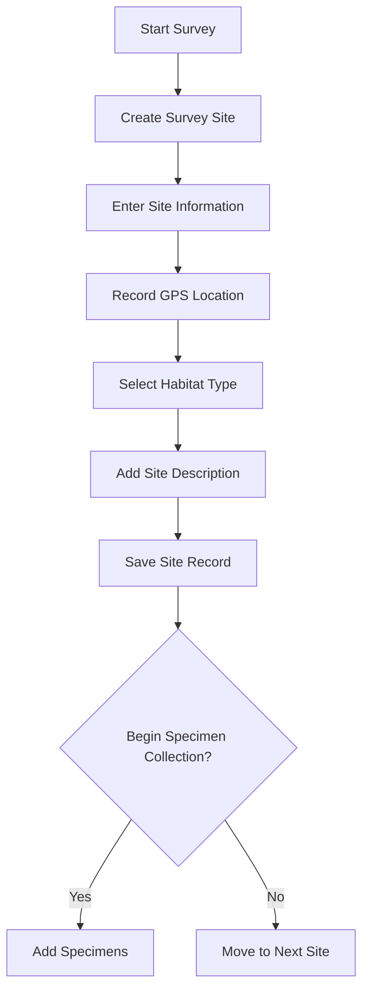
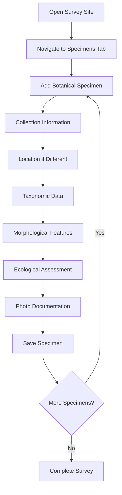
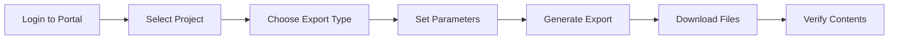

# Botanical Collection - Workflow Guide

## Overview
This guide provides step-by-step workflows for conducting botanical surveys using the FAIMS3 Botanical Collection notebook, from initial site setup through specimen documentation and data export.

## Table of Contents
1. [Pre-Survey Preparation](#pre-survey-preparation)
2. [Survey Site Creation](#survey-site-creation)
3. [Specimen Collection Workflow](#specimen-collection-workflow)
4. [Morphological Documentation](#morphological-documentation)
5. [Data Quality Control](#data-quality-control)
6. [Export and Analysis](#export-and-analysis)

## Pre-Survey Preparation

### Equipment Checklist
- [ ] Mobile device with FAIMS3 app
- [ ] GPS enabled and tested
- [ ] Camera functioning
- [ ] Field guides and keys
- [ ] Collection supplies (if taking herbarium specimens)
- [ ] Measuring tape/ruler
- [ ] Hand lens
- [ ] Plant press (if collecting)
- [ ] Collection bags and labels

### Digital Preparation
1. Load botanical notebook
2. Sync to get latest version
3. Test GPS accuracy
4. Clear photo storage space
5. Review species lists for area
6. Set up reference materials

## Survey Site Creation

### Workflow Diagram


### Step-by-Step Instructions

#### 1. Initialize Survey Site
1. Open FAIMS3 app
2. Select "Botanical Collection - Complete"
3. Tap "Create New Record"
4. Choose "Survey Site" form

#### 2. Site Information Tab
1. **Site ID**: Auto-generated (note for reference)
2. **Survey Date**: 
   - Tap date field
   - Select today's date
   - Format: YYYY-MM-DD
3. **Site Name**:
   - Enter descriptive name
   - Include landmark references
   - Example: "Creek Reserve - Eastern Meadow"
4. **Site Reference**: 
   - Auto-generated HRID
   - Format: SITE-[date]-[ID]
   - Example: "SITE-2024-03-15-0001"

#### 3. Site Location & Habitat Tab
1. **GPS Location**:
   - Tap "Record GPS Location"
   - Wait for accuracy < 10m
   - Add location notes if needed
2. **Habitat Type**:
   ```
   Select primary ecosystem:
   - Forest (closed canopy woodland)
   - Grassland (open grassy areas)
   - Wetland (swamps, marshes)
   - Coastal (beaches, dunes)
   - Alpine (high elevation)
   - Desert (arid regions)
   - Urban (parks, gardens)
   - Agricultural (farms, orchards)
   - Other (specify in notes)
   ```
3. **Site Description**:
   - Describe general characteristics
   - Note dominant vegetation
   - Record environmental conditions
   - Include access information

#### 4. Save and Continue
- Review all fields
- Tap "Save" button
- Site HRID displayed
- Ready for specimen collection

## Specimen Collection Workflow

### Workflow Diagram


### Detailed Collection Steps

#### 1. Access Parent Site
- Use site HRID to find record
- Open site for editing
- Navigate to "Specimens" tab
- Tap "Add Botanical Specimens"

#### 2. Collection Information Tab
1. **Specimen ID**: Auto-generated
2. **Collection Number**: 
   - Auto-generated HRID
   - Format: BOT-[date]-[ID]
3. **Collection Date**:
   - Usually same as survey date
   - Adjust if collecting over multiple days
4. **Collector Name**:
   - Enter full name
   - Use consistent format
   - Include initials if multiple collectors

#### 3. Location & Habitat Tab
1. **GPS Location** (if different from site):
   - Record for rare species
   - Mark specific populations
   - Note microhabitat variations
2. **Habitat Type**:
   - May differ from site level
   - Record immediate environment
   - Consider edge effects

#### 4. Taxonomy Tab
1. **Species Name**:
   - Use binomial nomenclature
   - Include subspecies if known
   - Example: "Eucalyptus camaldulensis"
2. **Common Name**:
   - Local or widely used name
   - Multiple names separated by commas
3. **Family**:
   - Taxonomic family
   - Use standard abbreviations
   - Example: "Myrtaceae"

#### 5. Morphology Tab
1. **Plant Height**:
   - Measure in centimeters
   - Estimate if tree
   - Record maximum height
2. **Flower Colors**:
   - Select all that apply
   - Consider variations
   - Note patterns in notes
3. **Specimen Photos**:
   - Whole plant view
   - Flowers/fruits close-up
   - Leaves (both sides)
   - Bark/stem details
   - Include scale reference

#### 6. Ecology & Notes Tab
1. **Abundance**:
   ```
   Rare: 1-2 individuals seen
   Uncommon: 3-10 individuals
   Common: 11-100 individuals
   Abundant: >100 individuals
   ```
2. **Field Notes**:
   - Habitat associations
   - Phenological stage
   - Associated species
   - Unusual features
   - Collection number if taken
3. **Herbarium Specimen**:
   - Check if physical specimen collected
   - Note collection number
   - Record preparation method

## Morphological Documentation

### Photography Best Practices

#### Standard Photo Series
1. **Habitat Shot**:
   - Show plant in context
   - Include surroundings
   - Capture growth form

2. **Whole Plant**:
   - Full height if possible
   - Show branching pattern
   - Include scale object

3. **Diagnostic Features**:
   - Flowers (multiple angles)
   - Fruits/seeds
   - Leaf arrangement
   - Leaf close-ups (upper/lower)
   - Bark texture
   - Special features

#### Technical Tips
- Use natural light when possible
- Avoid harsh shadows
- Focus on key features
- Include ruler or coin for scale
- Take multiple shots
- Check focus before moving on

### Measurement Guidelines

#### Height Categories
- Herbs: Measure precisely (cm)
- Shrubs: Measure to nearest 10cm
- Trees: Estimate (note method)

#### Recording Variations
- Note range if variable
- Record maximum observed
- Include growth stage
- Consider seasonal changes

## Data Quality Control

### Field Validation

#### Daily Checklist
- [ ] All sites have GPS coordinates
- [ ] Specimen-site relationships correct
- [ ] Photos properly attached
- [ ] Required fields completed
- [ ] Taxonomic names spell-checked
- [ ] Abundance assessments logical

### Common Errors and Fixes

| Error | Detection | Solution |
|-------|-----------|----------|
| Missing GPS | No coordinates shown | Re-record in open area |
| Wrong habitat | Mismatch with photos | Edit and correct |
| Spelling errors | Review species list | Use reference guide |
| Orphan specimens | No parent site | Create from site record |
| Blurry photos | Visual check | Retake if critical |

### Taxonomic Verification

#### In-Field Checks
1. Compare with field guides
2. Use diagnostic keys
3. Photo all uncertainties
4. Note confidence level
5. Collect voucher if unsure

#### Post-Field Review
1. Check spelling against databases
2. Verify family assignments
3. Update taxonomy if needed
4. Add determiner notes
5. Link to herbarium numbers

## Export and Analysis

### Data Export Process

#### Preparation Steps
1. Sync all data
2. Review completeness
3. Check relationships
4. Verify photo uploads
5. Clean any errors

#### Export Workflow


### Export Formats

#### For Species Lists
- **CSV Format**: Simple species inventory
- **Filtered by**: Site, date, habitat
- **Includes**: Species, abundance, habitat

#### For Herbarium Labels
- **Custom Template**: Specimen details
- **Includes**: Full taxonomy, location, collector
- **Format**: Ready for label printing

#### For Research
- **Full JSON**: Complete relationships
- **Darwin Core**: Museum standards
- **GeoJSON**: Spatial analysis

### Analysis Workflows

#### Species Richness
1. Export specimen data
2. Group by site
3. Count unique species
4. Compare habitats
5. Generate reports

#### Distribution Mapping
1. Export with GPS
2. Import to GIS
3. Create distribution maps
4. Analyze patterns
5. Identify hotspots

#### Phenological Analysis
1. Filter by species
2. Sort by date
3. Map flowering times
4. Track climate relationships
5. Predict future patterns

## Best Practices Summary

### Do's
- ✓ Complete site info before specimens
- ✓ Record GPS for rare species
- ✓ Take comprehensive photos
- ✓ Use standard nomenclature
- ✓ Sync data frequently
- ✓ Backup photos separately
- ✓ Review entries daily

### Don'ts
- ✗ Create orphan specimens
- ✗ Skip habitat recording
- ✗ Use common names only
- ✗ Forget scale in photos
- ✗ Leave taxonomy uncertain
- ✗ Work offline for days
- ✗ Delete without backup

## Troubleshooting Reference

### Quick Solutions

| Problem | Quick Fix | Prevention |
|---------|-----------|------------|
| GPS timeout | Move to open area | Start GPS early |
| Species uncertain | Photo all parts | Bring references |
| App crashes | Restart and sync | Update regularly |
| Photos missing | Check storage | Clear space daily |
| Slow performance | Close other apps | Restart device |

### Getting Help

#### In-Field Support
- Taxonomic experts: [Contact list]
- Technical support: [Help desk]
- Regional botanists: [Network list]

#### Resources
- Flora keys: [Digital library]
- Photo guides: [Online database]
- Training videos: [Portal link]

## Advanced Tips

### Efficient Survey Strategies

#### Transect Method
1. Set site at transect start
2. Add specimens along route
3. Record distance from start
4. Note position in field notes
5. Complete at transect end

#### Plot-Based Survey
1. Create site for plot
2. Systematic search pattern
3. Complete species list
4. Estimate cover values
5. Photo plot overview

#### Rapid Assessment
1. Focus on dominant species
2. Note rare/unusual only
3. General abundance categories
4. Representative photos
5. Emphasize efficiency

This comprehensive workflow ensures high-quality botanical data collection while maintaining scientific rigor and maximizing field efficiency.