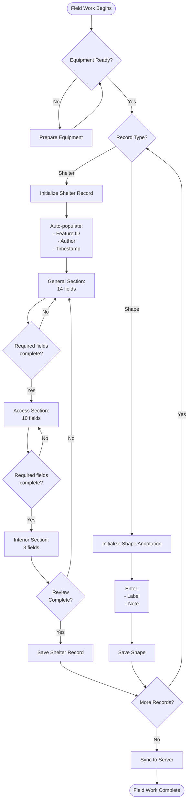
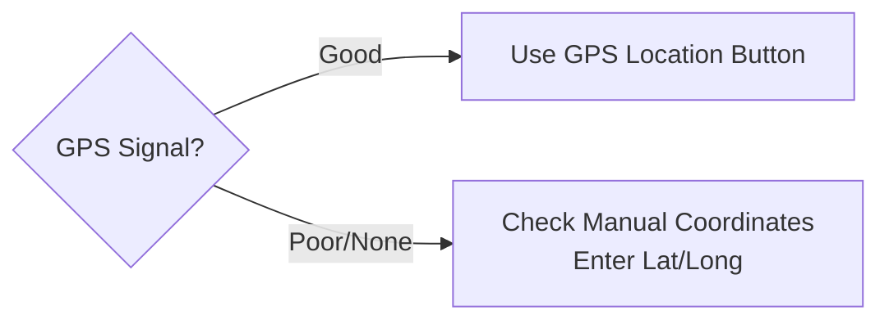
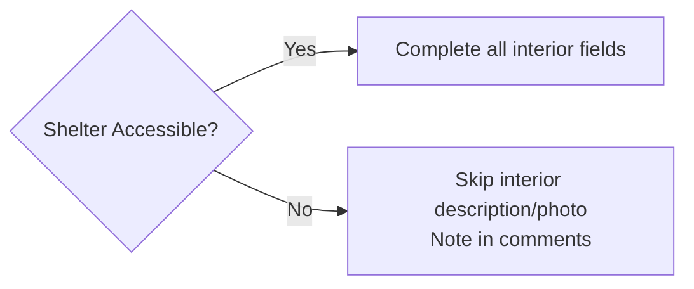
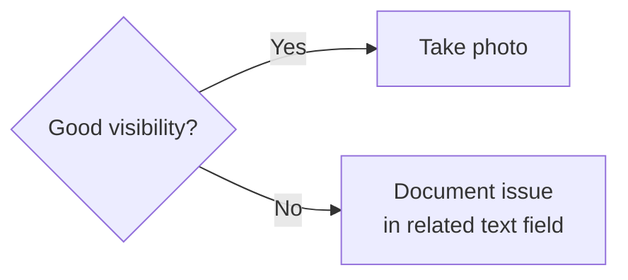

# Aarhus Shelters Data Capture Workflow Documentation

## Overview

This document describes the data capture workflow for the Aarhus Civil Defense Shelter Monitoring system, providing transparency about the data collection process for research reproducibility.

## Workflow Stages

### Stage 1: Pre-Field Preparation
1. **Equipment Check**
   - Mobile device with FAIMS3 app
   - GPS enabled and tested
   - Camera functional
   - Compass for directional readings
   - Measuring tape for distance measurements
   - Reference images for shelter types

2. **Data Synchronization**
   - Connect to network
   - Sync any pending records
   - Download latest notebook version

### Stage 2: Field Data Collection

#### 2.1 Record Initiation
1. Open notebook and select "Shelter" record type
2. System auto-generates unique Feature ID
3. System captures current user as author
4. System sets timestamp to current date/time

#### 2.2 General Information Capture
**Sequential data entry through three sections:**

##### General Section (14 fields)
1. **Classification** (2 fields)
   - Select Feature Type* from dropdown (reference images needed)
   - Select Feature Source (discovery method)
   
2. **Design Documentation** (2 fields)
   - Select Number of Iterations (count of repeated designs)
   - Enter Feature Description (free text)

3. **Location Capture** (4 fields)
   - Press GPS Location button* to capture coordinates
   - OR check Manual Coordinates and enter Latitude/Longitude
   - System records accuracy automatically

4. **Site Context** (4 fields)
   - Select Landuse on Top* (surface covering)
   - Select Landuse Around (environment type)
   - Capture Overview Photo
   - Enter Locale Description (address/directions)

##### Access Section (10 fields)
1. **Entryway Documentation** (5 fields)
   - Select Entryway Type*
   - Select Accessibility Status*
   - Measure Entryway Direction* with compass
   - Enter Access Comments
   - Capture Entryway Photo

2. **Emergency Exit Documentation** (5 fields)
   - Select Emergency Exit Shape*
   - Select Emergency Exit Location*
   - Enter Exit Notes
   - Capture Emergency Exit Photo
   - Measure Swan Neck Distance (if applicable)

##### Interior Section (3 fields)
1. Enter Interior Description (if accessible)
2. Capture Interior Photo (if accessible)
3. Enter Comments and Recommendations

#### 2.3 Data Quality Assurance
- Required fields marked with asterisk (*) - 9 total
- Validation prevents saving without required data
- Annotation feature available for uncertainty
- Review all sections before saving

#### 2.4 Record Completion
1. Save record locally
2. Record stored on device
3. Continue to next shelter or shape annotation

### Stage 3: Optional Shape Annotation
For spatial features not captured as shelter records:
1. Select "Shape" record type
2. Enter Shape Label
3. Enter Shape Note
4. Save annotation

### Stage 4: Post-Field Processing
1. **Data Upload**
   - Connect to network
   - Sync all records to server
   - Verify photo uploads complete

2. **Quality Check**
   - Review uploaded records
   - Check photo quality
   - Verify GPS accuracy

## Workflow Diagram (Mermaid)

## Decision Points

### 1. GPS vs Manual Coordinates

### 2. Interior Access

### 3. Photo Documentation
Each photo field follows this pattern:

## Data Flow

### Input Sources
1. **Automated**
   - Feature ID (system generated)
   - Author (from user context)
   - Timestamp (system time)
   - GPS coordinates (device GPS)

2. **Manual Entry**
   - Controlled vocabularies (dropdowns)
   - Free text descriptions
   - Measurements
   - Photos

3. **External References**
   - Shelter type images
   - Iteration pattern images
   - Compass readings

### Output Format
- JSON records with all field values
- Binary attachments (photos) linked by reference
- Metadata (annotations, uncertainty) embedded

## Quality Control Mechanisms

### 1. Validation Rules
- 9 required fields must be completed
- Controlled vocabularies restrict invalid entries
- Data types enforced (numbers, dates, etc.)

### 2. User Guidance
- Helper text on each field
- Reference to external guides
- Logical section progression

### 3. Data Preservation
- Auto-save functionality
- Local storage before sync
- Conflict resolution during sync

## Workflow Variations

### Scenario 1: Standard Shelter Documentation
- Full workflow as described above
- All sections completed
- 4 photos typically captured

### Scenario 2: Inaccessible Shelter
- General and Access sections completed
- Interior section: description only, note inaccessibility
- 2-3 photos captured

### Scenario 3: Multiple Iterations
- Document GPS at each entrance
- Note in description which iteration
- May require multiple records

### Scenario 4: Non-Shelter Features
- Use Shape annotation
- Minimal data capture
- Links to nearby shelter if relevant

## Temporal Aspects

### Time per Record
- Standard shelter: 10-15 minutes
- Complex/multiple iterations: 20-30 minutes
- Shape annotation: 2-3 minutes

### Daily Productivity
- Typical: 15-25 shelters per day
- Factors: travel time, accessibility, complexity

## Research Integrity Features

### 1. Traceability
- Every record tagged with author and timestamp
- Changes tracked through sync system
- Photo metadata preserved

### 2. Uncertainty Documentation
- Annotation system for ambiguous data
- Uncertainty flags for questionable values
- Free text for additional context

### 3. Standardization
- Controlled vocabularies ensure consistency
- Required fields guarantee minimum dataset
- Systematic progression through sections

This workflow ensures systematic, reproducible data collection while maintaining flexibility for field conditions and unique observations.