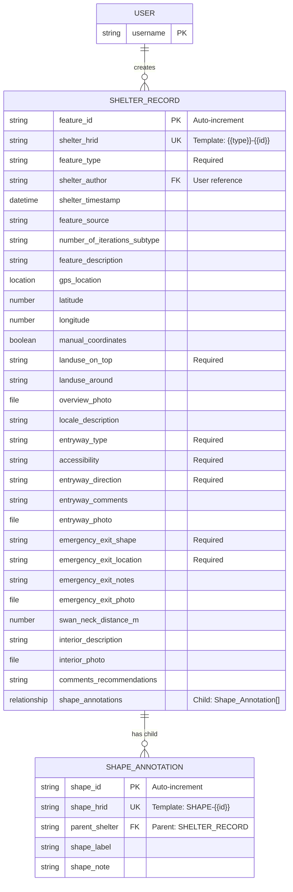

# Aarhus Shelters Data Model Documentation

## Overview

This document describes the data model extracted from the Aarhus Civil Defense Shelter Monitoring notebook, providing metadata for datasets collected using this system. The model consists of two primary entity types with defined attributes and implicit relationships.

## Entity-Relationship Model

### Entities

#### 1. Shelter Record (Primary Entity)
**Purpose**: Documents individual civil defense shelters or related structures  
**Identifier**: `feature-id` (auto-incremented string)

##### Attributes

###### Core Identification
- `feature-id` (String, Required): Unique auto-generated identifier
- `feature-type` (String, Required): Classification from controlled vocabulary
- `shelter-author` (String): Recording user (auto-populated)
- `shelter-timestamp` (Datetime): Recording timestamp (auto-populated)

###### Discovery & Classification
- `feature-source` (String): How the shelter was discovered
- `number-of-iterations-subtype` (String): Repetition count of basic design
- `feature-description` (String): Free-text preservation state and characteristics

###### Spatial Data
- `gps-location` (Location Object): Primary GPS coordinates
- `latitude` (Number, Conditional): Manual coordinate entry
- `longitude` (Number, Conditional): Manual coordinate entry
- `manual-coordinates` (Boolean): Toggle for manual entry mode

###### Site Context
- `landuse-on-top` (String, Required): Surface covering classification
- `landuse-around` (String): Surrounding environment classification
- `overview-photo` (File): Site documentation image
- `locale-description` (String): Address and directions

###### Access Features
- `entryway-type` (String, Required): Entrance classification
- `accessibility-of-shelter-during-visit` (String, Required): Current access status
- `entryway-faces-direction` (String, Required): Compass direction
- `comments-on-entryway-and-access` (String): Access notes
- `entryway-photo` (File): Entrance documentation

###### Emergency Exit
- `emergency-exit-shape` (String, Required): Exit geometry
- `emergency-exit-location` (String, Required): Exit position
- `notes-on-emergency-exit` (String): Additional observations
- `emergency-exit-photo` (File): Exit documentation
- `distance-from-swan-neck-to-emergency-exit-m` (Number): Measurement in meters

###### Interior Documentation
- `interior-description` (String): Internal features description
- `interior-photo` (File): Interior documentation
- `comments-and-recommendations` (String): Final observations

#### 2. Shape Annotation (Secondary Entity)
**Purpose**: Spatial annotations or supplementary map features  
**Identifier**: Implicit (no explicit ID field)

##### Attributes
- `shape-label` (String): Brief identifier
- `shape-note` (String): Detailed description

### Relationships

#### Implicit Relationships
1. **User → Shelter Record**: One-to-many relationship via `shelter-author`
2. **Shelter Record → Files**: One-to-many via photo fields (4 photo attachments possible)
3. **Shelter Record → Shape Annotation**: Potential one-to-many (not explicitly defined)

### Data Types

| Type | Description | Fields Using Type |
|------|-------------|-------------------|
| String | Text data | 20 fields |
| Number | Numeric values | 3 fields |
| Datetime | Timestamp | 1 field |
| Location | GPS coordinates | 1 field |
| File | Binary attachments | 4 fields |
| Boolean | True/false | 1 field |

### Controlled Vocabularies

#### Feature Type (10 values)
- Shelter Type I-VI (architectural classifications)
- Bunker
- Emergency hospital
- Observation post
- Other

#### Compass Directions (18 values)
- 16 compass points (N, NNE, NE, ENE, E, ESE, SE, SSE, S, SSW, SW, WSW, W, WNW, NW, NNW)
- NOT AVAILABLE
- OTHER

#### Access Status (6 values)
- NA
- Other
- Barred (concrete slabs or earthen cover)
- Sealed (concrete layer)
- Locked
- Open

#### Additional Vocabularies
- Feature Source (6 values)
- Number of Iterations (8 values)
- Landuse classifications (9 values each for top/around)
- Entryway Type (5 values)
- Emergency Exit Shape (4 values)
- Emergency Exit Location (5 values)

## Data Model Diagram (Mermaid)

## Data Integrity Rules

### Required Fields (13 total)
1. feature-id (auto-generated)
2. feature-type
3. gps-location (or manual coordinates)
4. landuse-on-top
5. entryway-type
6. accessibility-of-shelter-during-visit
7. entryway-faces-direction
8. emergency-exit-shape
9. emergency-exit-location

### Conditional Logic
- Manual coordinate fields (latitude/longitude) only visible when `manual-coordinates` = true
- GPS location preferred over manual entry

### Validation Constraints
- All required fields must be non-empty
- Numeric fields accept decimal values
- File fields accept image attachments
- Controlled vocabulary fields restricted to predefined values

## Metadata Support

### Annotation System
Each field in shelter-record supports:
- **Annotation**: Free-text notes about the field value
- **Uncertainty**: Confidence indicator for the recorded value

This allows researchers to document:
- Ambiguous observations
- Environmental constraints affecting data quality
- Alternative interpretations
- Measurement limitations

## Research Context

This data model supports archaeological documentation of Cold War infrastructure with emphasis on:
1. **Preservation assessment**: Current condition and accessibility
2. **Typological classification**: Architectural variations
3. **Spatial distribution**: GPS-based mapping
4. **Photographic record**: Visual documentation
5. **Access evaluation**: Public safety considerations

The model balances standardized data collection (controlled vocabularies) with flexibility for unique observations (free-text fields and annotations).

## Data Capture Process

1. **Shelter Record Creation**
   - System generates unique Feature ID and HRID
   - User completes four sections of data (including relationships)
   - 9 required fields must be completed
   - Photos captured for documentation
   - Location recorded via GPS or manual entry
   - Shape annotations can be added from Related Records tab

2. **Shape Annotation Creation**
   - Created as child records from parent Shelter
   - System generates unique Shape ID and HRID
   - Automatically linked to parent shelter
   - Minimal data requirements
   - Used for additional spatial features related to the shelter

## Data Export Structure

Data exports maintain field-level metadata including:
- Field values with HRIDs for easy identification
- Parent-child relationships preserved
- Annotation text (where enabled)
- Uncertainty indicators (where enabled)
- Photo references (file paths/URLs)
- GPS coordinates with accuracy metrics
- User attribution
- Timestamps

## Key Design Features

1. **Human-Readable IDs**: Both entities use HRIDs for easy identification in lists and reports
2. **Parent-Child Integrity**: Shape annotations are explicitly linked to shelters, preventing orphaned records
3. **Hierarchical Export**: Data can be exported with nested structure showing shelters and their annotations
4. **Consistent Patterns**: HRIDs follow clear patterns for easy recognition