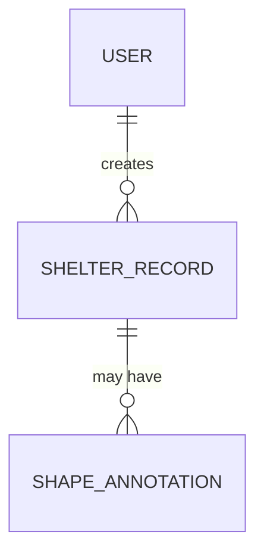
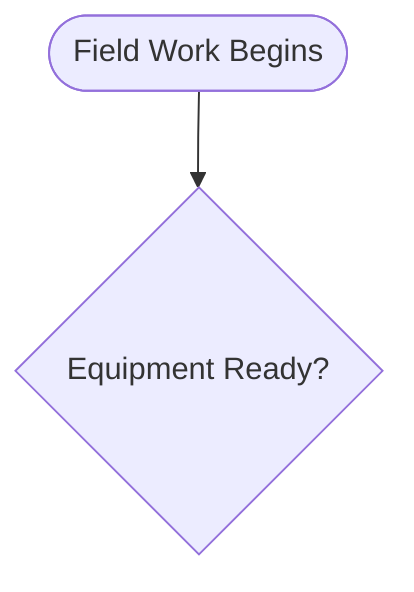
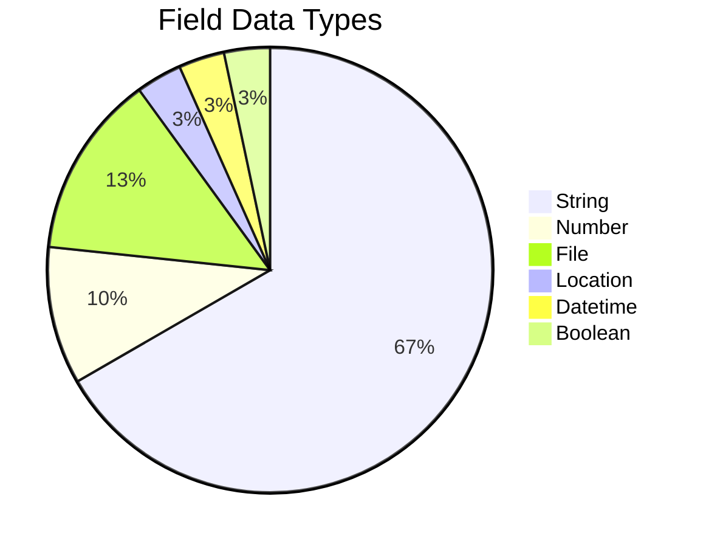
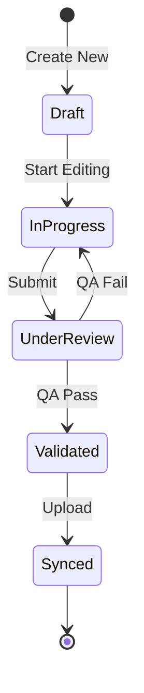
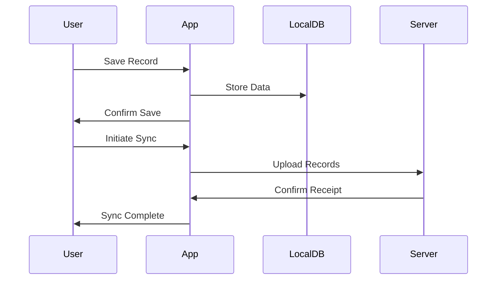
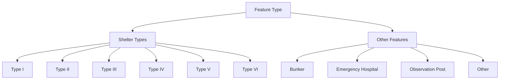
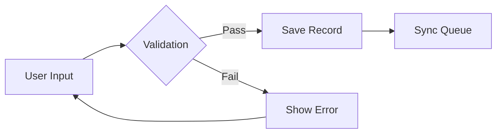

# Diagram Feasibility Assessment for Aarhus Shelters Documentation

## Overview

This document assesses the feasibility of creating visual diagrams to represent the data model and workflow for the Aarhus Shelters monitoring system.

## Implemented Diagrams

### 1. Entity-Relationship Diagram (Data Model)
**Tool**: Mermaid ER Diagram  
**Status**: ✅ Implemented in data model documentation

**Strengths**:
- Clearly shows entity relationships
- Displays field types and constraints
- Indicates primary/foreign keys
- Shows cardinality

**Limitations**:
- Cannot show all 29 fields clearly (requires abbreviation)
- No support for showing controlled vocabularies inline
- Limited styling options for emphasis

### 2. Workflow Flowchart
**Tool**: Mermaid Flowchart  
**Status**: ✅ Implemented in workflow documentation

**Strengths**:
- Excellent for showing process flow
- Supports decision points
- Can show parallel processes
- Good for highlighting critical paths

**Limitations**:
- Becomes complex with all field details
- Difficult to show data types/validation
- Limited space for text in nodes

### 3. Decision Tree Diagrams
**Tool**: Mermaid Flowchart (LR orientation)  
**Status**: ✅ Implemented for key decisions

**Example Use Cases**:
- GPS vs Manual coordinate entry
- Interior accessibility decisions
- Photo capture conditions

## Additional Diagram Opportunities

### 1. Data Type Distribution (Pie Chart)

### 2. Section Field Count (Bar Chart)
Would show:
- General Section: 14 fields
- Access Section: 10 fields  
- Interior Section: 3 fields
- Shape Section: 2 fields

### 3. State Diagram (Record Lifecycle)

### 4. Sequence Diagram (Data Sync)

## Alternative Visualization Tools

### 1. PlantUML
**Pros**: More detailed UML support, better for complex models  
**Cons**: Requires external processing, not native markdown

### 2. Graphviz
**Pros**: Powerful layout algorithms, extensive customization  
**Cons**: Steeper learning curve, complex syntax

### 3. Draw.io/diagrams.net
**Pros**: GUI-based, exports to many formats  
**Cons**: Not text-based, requires external tool

### 4. D2 (Declarative Diagramming)
**Pros**: Modern, designed for documentation  
**Cons**: Newer tool, less widespread support

## Recommendations

### For Data Models
1. **Primary**: Mermaid ER diagrams for entity relationships
2. **Supplementary**: Pie/bar charts for field statistics
3. **Optional**: PlantUML for detailed class diagrams

### For Workflows
1. **Primary**: Mermaid flowcharts for main process
2. **Supplementary**: Decision trees for complex choices
3. **Optional**: BPMN notation for formal documentation

### Implementation Strategy
1. **Embed in Markdown**: Use Mermaid for GitHub/GitLab rendering
2. **Export Static**: Generate PNG/SVG for reports
3. **Maintain Source**: Keep diagram source in version control
4. **Progressive Detail**: Start simple, add detail as needed

## Code Examples for Additional Diagrams

### Vocabulary Hierarchy

### Validation Flow

## Conclusion

Mermaid diagrams are highly feasible and recommended for documenting both the data model and workflow. They provide:
- Native markdown integration
- Sufficient complexity for the use case
- Good balance of clarity and detail
- Version control friendly (text-based)
- Wide platform support

The implemented diagrams successfully convey the essential structure and process while remaining maintainable and extensible for future documentation needs.