# MEMSAP Survey 2016 - Data Schema

## Entity Relationship Diagram

```mermaid
erDiagram
    SURVEY_UNIT {
        string survey_unit_id PK "Auto-increment"
        string survey_unit_hrid UK "Template: {{team}}-{{id}}-SU"
        string team FK "A|B|C"
        string survey_line_number "Required"
        string recorded_by "Required"
        datetime timestamp "Auto"
        location start_gps_location "Required"
        number total_width "meters"
        integer number_of_walkers
        string participants "Multi-line"
        string photo_file_numbers
        string landform_type "Controlled vocab"
        string landform_remarks "Multi-line"
        string surface_visibility "10-100%"
        string visibility_remarks "Multi-line"
        string artifact_exposure "10-100%"
        string erosion_type "Multi-line"
        string geomorphic_summary "Required vocab"
        string cobble_distribution "Vocab"
        integer cobbles_per_m2
        string cobble_remarks
        array sediment_size "Multi-select"
        string sediment_thickness "Vocab"
        location end_gps_location "Required"
        string transect_remarks "Multi-line"
        files transect_photo "Multiple"
        relationship poi_cobbles "Child: POI_Cobble[]"
        relationship poi_cores "Child: POI_Core[]"
        relationship artefact_flakes "Child: Artefact_Flake[]"
        relationship artefact_cores "Child: Artefact_Core[]"
        relationship artefact_shatter "Child: Artefact_Shatter[]"
        relationship artefact_other "Child: Artefact_Other[]"
        relationship sites "Child: Site[]"
    }

    POI_COBBLE {
        string poi_id PK "Auto-increment"
        string poi_hrid UK "Template: {{team}}-{{id}}-POI"
        string parent_survey_unit FK "Parent: SURVEY_UNIT"
        string team FK "A|B|C inherited"
        string recorded_by "Required"
        location gps_location "Required"
        number weight_g "Required"
        number length_mm "Required"
        number width_mm "Required"
        number thickness_mm "Required"
        string raw_material "Required vocab"
        string crystal_size "Vocab"
        string abundance_of_flaws "10-100%"
        string cobble_angularity "Vocab"
        string poi_notes "Multi-line"
        files poi_photo "Multiple"
    }

    POI_CORE {
        string poi_id PK "Auto-increment"
        string poi_hrid UK "Template: {{team}}-{{id}}-POI"
        string parent_survey_unit FK "Parent: SURVEY_UNIT"
        string team FK "A|B|C inherited"
        string recorded_by "Required"
        location gps_location "Required"
        number weight_g "Required"
        number length_mm "Required"
        number width_mm "Required"
        number thickness_mm "Required"
        string raw_material "Required vocab"
        string crystal_size "Vocab"
        string abundance_of_flaws "10-100%"
        string completeness "Complete|Broken"
        string weathering "Fresh|Slightly|Weathered"
        string cortex_coverage_whole "10-100%"
        string cortex_coverage_upper "10-100%"
        string cortex_coverage_lower "10-100%"
        integer flake_scars_10mm
        integer number_of_platforms
        string flaking_on_perimeter "10-100%"
        string core_typology "Vocab"
        string poi_notes "Multi-line"
        files poi_photo "Multiple"
    }

    ARTEFACT_FLAKE {
        string artefact_id PK "Auto-increment"
        string artefact_hrid UK "Template: {{team}}-{{id}}-ART"
        string parent_survey_unit FK "Parent: SURVEY_UNIT"
        string team FK "A|B|C inherited"
        string recorded_by "Required"
        location gps_location "Required"
        number weight_g "Required"
        number length_mm "Required"
        number width_mm "Required"
        number thickness_mm "Required"
        string thickness_measured_at "Bulb|Other"
        string raw_material "Required vocab"
        string crystal_size "Vocab"
        string abundance_of_flaws "10-100%"
        string longitudinal_portion "Vocab"
        string transverse_portion "Vocab"
        string platform_type "Vocab"
        boolean platform_cortex
        string termination_type "Vocab"
        string dorsal_cortex "10-100%"
        string flake_typology "Vocab"
        string scar_orientation "Vocab"
        integer dorsal_scars_15mm
        boolean retouched
        string flake_comments "Multi-line"
    }

    ARTEFACT_CORE {
        string artefact_id PK "Auto-increment"
        string artefact_hrid UK "Template: {{team}}-{{id}}-ART"
        string parent_survey_unit FK "Parent: SURVEY_UNIT"
        string team FK "A|B|C inherited"
        string recorded_by "Required"
        location gps_location "Required"
        number weight_g "Required"
        number length_mm "Required"
        number width_mm "Required"
        number thickness_mm "Required"
        string raw_material "Required vocab"
        string crystal_size "Vocab"
        string abundance_of_flaws "10-100%"
        string completeness "Complete|Broken"
        string weathering "Fresh|Slightly|Weathered"
        string cortex_coverage_whole "10-100%"
        string cortex_coverage_upper "10-100%"
        string cortex_coverage_lower "10-100%"
        integer flake_scars_10mm
        integer number_of_platforms
        string flaking_on_perimeter "10-100%"
        string core_typology "Vocab"
        string artefact_notes "Multi-line"
        files artefact_photo "Multiple"
    }

    ARTEFACT_SHATTER {
        string artefact_id PK "Auto-increment"
        string artefact_hrid UK "Template: {{team}}-{{id}}-ART"
        string parent_survey_unit FK "Parent: SURVEY_UNIT"
        string team FK "A|B|C inherited"
        string recorded_by "Required"
        location gps_location "Required"
        number weight_g "Required"
        number length_mm "Required"
        number width_mm "Required"
        number thickness_mm "Required"
        string raw_material "Required vocab"
        string crystal_size "Vocab"
        string abundance_of_flaws "10-100%"
        string cortical_coverage "10-100%"
        string shatter_notes "Multi-line"
        files shatter_photo "Multiple"
    }

    ARTEFACT_OTHER {
        string artefact_id PK "Auto-increment"
        string artefact_hrid UK "Template: {{team}}-{{id}}-ART"
        string parent_survey_unit FK "Parent: SURVEY_UNIT"
        string team FK "A|B|C inherited"
        string recorded_by "Required"
        location gps_location "Required"
        string other_artefact_type "Required vocab"
        number weight_g "Required"
        number length_mm "Required"
        number width_mm "Required"
        number thickness_mm "Required"
        string raw_material "Required vocab"
        string crystal_size "Vocab"
        string abundance_of_flaws "10-100%"
        string other_notes "Multi-line"
        files other_photo "Multiple"
    }

    SITE {
        string site_id PK "Auto-increment"
        string site_hrid UK "Template: {{team}}-{{id}}-SITE"
        string parent_survey_unit FK "Parent: SURVEY_UNIT"
        string team FK "A|B|C inherited"
        string recorded_by "Required"
        string site_name "Required"
        location gps_location "Required"
        string survey_line_number "Inherited"
        string site_type "Required vocab"
        array estimated_age "Multi-select"
        array materials_present "Multi-select"
        array site_condition "Multi-select"
        string recommendation "Vocab"
        string site_notes "Multi-line"
        files site_photo "Multiple"
    }

    TEAM {
        string team_id PK "A|B|C"
        string team_name
    }

    SURVEY_UNIT ||--o{ POI_COBBLE : "has child"
    SURVEY_UNIT ||--o{ POI_CORE : "has child"
    SURVEY_UNIT ||--o{ ARTEFACT_FLAKE : "has child"
    SURVEY_UNIT ||--o{ ARTEFACT_CORE : "has child"
    SURVEY_UNIT ||--o{ ARTEFACT_SHATTER : "has child"
    SURVEY_UNIT ||--o{ ARTEFACT_OTHER : "has child"
    SURVEY_UNIT ||--o{ SITE : "has child"
    
    TEAM ||--o{ SURVEY_UNIT : "conducts"
```

## Entity Descriptions

### Core Entities

#### SURVEY_UNIT (Transect)
The primary recording unit representing one pedestrian survey transect. Contains:
- **Identification**: Auto-incremented ID with team-based HRID
- **Spatial data**: Start and end GPS coordinates
- **Team data**: Team designation, participants, recorder
- **Physical parameters**: Width, walker count
- **Environmental data**: Landform, visibility, geomorphology
- **Documentation**: Photos and remarks
- **Child Records**: Related record fields for all find types:
  - `poi_cobbles`: POI Cobble records
  - `poi_cores`: POI Core records
  - `artefact_flakes`: Artefact Flake records
  - `artefact_cores`: Artefact Core records
  - `artefact_shatter`: Artefact Shatter/Fragment records
  - `artefact_other`: Other Artefact records
  - `sites`: Site records

#### Points of Interest (POI)
Two specialized types for significant non-collected materials:

**POI_COBBLE**: Raw material cobbles found during survey
- Parent Survey Unit reference (automatic)
- Team inherited from parent
- Basic metrics (weight, dimensions)
- Material properties
- Angularity assessment

**POI_CORE**: Cores found but not collected
- Parent Survey Unit reference (automatic)
- Team inherited from parent
- All cobble fields plus
- Detailed technological analysis
- Flaking patterns and typology

#### ARTEFACT Types
Four specialized types for collected archaeological materials:

**ARTEFACT_FLAKE**: Lithic flakes with detailed technological attributes
- Parent Survey Unit reference (automatic)
- Team inherited from parent
- Platform characteristics
- Dorsal surface analysis
- Retouch presence

**ARTEFACT_CORE**: Collected cores (same analysis as POI_CORE)
- Parent Survey Unit reference (automatic)
- Team inherited from parent

**ARTEFACT_SHATTER**: Simplified recording for fragments
- Parent Survey Unit reference (automatic)
- Team inherited from parent
- Basic metrics only
- Cortical coverage

**ARTEFACT_OTHER**: Catch-all for other artifact types
- Parent Survey Unit reference (automatic)
- Team inherited from parent
- Type specification (hammerstone, grindstone, etc.)
- Basic metrics

#### SITE
Archaeological sites discovered during survey:
- Parent Survey Unit reference (automatic)
- Team and survey line inherited from parent
- Named locations
- Type classification
- Age estimates (multiple possible)
- Condition assessment
- Investigation recommendations

### Relationship Patterns

1. **Parent-Child Hierarchy**: All POIs, Artefacts, and Sites are children of a Survey Unit
   - Created through RelatedRecordSelector fields in Survey Unit
   - Parent reference stored in each child record
   - Enforces contextual integrity

2. **Team Association**: 
   - Survey Unit has direct team assignment
   - Child records inherit team from parent Survey Unit
   - Ensures consistency across related records

3. **Spatial Context**: 
   - Survey Unit defines the transect boundaries (start/end GPS)
   - Child records have specific GPS locations within transect
   - Enables spatial analysis within collection context

4. **Data Integrity**:
   - No orphaned records - all finds linked to a Survey Unit
   - Team and survey line inherited from parent
   - Relationships maintained through FAIMS3 relationship system

## Field Types and Constraints

### Data Types Used
- **string**: Text fields (single/multi-line)
- **number**: Decimal measurements (weight, dimensions)
- **integer**: Whole numbers (counts)
- **boolean**: Yes/no fields
- **datetime**: Timestamps
- **location**: GPS coordinates (lat/lon/accuracy object)
- **files**: Photo attachments (multiple allowed)
- **array**: Multi-select options
- **relationship**: Parent-child relationships (RelatedRecordSelector)

### Controlled Vocabularies

#### Raw Materials
- Quartz
- Quartzite
- Chert
- Silcrete
- Volcanic
- Sandstone
- Other

#### Percentage Fields
All use 10% increments: 10%, 20%, 30%... 100%

#### Landform Types
- Beach/Littoral
- Channel
- Dambo
- Floodplain
- Hillslope
- Hilltop
- Lacustrine
- Ridge
- Terrace

#### Site Types
- Rock shelter
- Cave
- Artefact scatter
- Quarry
- Rock art
- Other

## Key Design Decisions

1. **Separate POI/Artefact Entities**: Distinguishes between recorded-only vs collected materials
2. **Type-Specific Entities**: Rather than polymorphic design, uses separate entities for each artifact type
3. **Team-Based IDs**: All IDs incorporate team designation for uniqueness
4. **Human-Readable IDs**: TemplatedStringField creates meaningful identifiers (e.g., A-00001-POI)
5. **Enforced Parent-Child Relationships**: All finds must belong to a Survey Unit
   - Maintains archaeological context
   - Prevents orphaned records
   - Enables hierarchical queries
6. **Inheritance Pattern**: Child records inherit team and survey line from parent
7. **Comprehensive Lithic Analysis**: Maintains full technological attribute recording from FAIMS2

## Data Export Considerations

When exporting data:
1. **Hierarchy Export**: Export Survey Units with all child records nested
2. **Flat Export**: Join child records to parent Survey Unit for traditional analysis
3. **Team Analysis**: Filter by team at Survey Unit level (children automatically included)
4. **Spatial Analysis**: 
   - Survey Unit provides transect boundaries
   - Child records provide specific find locations
   - Parent-child links maintain collection context
5. **Assemblage Analysis**: Query child records by type with parent context preserved
6. **Data Integrity**: Parent references ensure no orphaned records in export

## Migration from Legacy Data

If importing from systems without explicit relationships:
1. Match records by survey line number and team
2. Use GPS proximity to verify associations
3. Create parent-child links based on temporal sequence
4. Validate all records have parent assignments

This schema enhances the original FAIMS2 module by adding explicit parent-child relationships while maintaining full analytical capabilities and ensuring data integrity through FAIMS3's relationship system.