# MEMSAP Archaeological Survey 2016 - Workflow Guide

## Overview
The MEMSAP (Malawi Earlier-Middle Stone Age Project) survey notebook is designed for systematic pedestrian survey with detailed lithic analysis. This guide walks through a complete transect recording workflow, from start to finish.

## Workflow Diagram

```mermaid
graph TB
    Start([Start Survey Day]) --> TeamSelect[Select Team A/B/C]
    TeamSelect --> CreateSU[Create Survey Unit/Transect]
    
    CreateSU --> SUBasic[/"📋 Basic Information<br/>- Auto ID: A-00001-SU<br/>- Team: A<br/>- Line Number: 12<br/>- Recorder: Jane Smith"/]
    
    SUBasic --> SUTransect[/"📍 Transect Details<br/>- Start GPS: -13.9834, 33.7751<br/>- Width: 50m<br/>- Walkers: 5<br/>- Participants list"/]
    
    SUTransect --> SULandform[/"🏞️ Landform & Visibility<br/>- Landform: Hillslope<br/>- Visibility: 70%<br/>- Artifact exposure: 40%<br/>- Erosion: Sheet wash"/]
    
    SULandform --> SUGeo[/"⛰️ Geomorphology<br/>- Context: Colluvial<br/>- Cobbles: 5-10/m²<br/>- Sediment: Sand, gravel<br/>- Thickness: 10-20cm"/]
    
    SUGeo --> SURel[/"🔗 Related Records<br/>Ready to add child records<br/>during transect walk"/]
    
    SURel --> Walking[Walking Transect]
    
    Walking --> FindPOI{Find POI?}
    FindPOI -->|Cobble| POICobble[Create POI-Cobble<br/>ID: A-00001-POI<br/>Parent: A-00001-SU]
    FindPOI -->|Core| POICore[Create POI-Core<br/>ID: A-00002-POI<br/>Parent: A-00001-SU]
    
    Walking --> FindArt{Find Artifact?}
    FindArt -->|Flake| ArtFlake[Create Artefact-Flake<br/>ID: A-00001-ART<br/>Parent: A-00001-SU]
    FindArt -->|Core| ArtCore[Create Artefact-Core<br/>ID: A-00002-ART<br/>Parent: A-00001-SU]
    FindArt -->|Shatter| ArtShatter[Create Artefact-Shatter<br/>ID: A-00003-ART<br/>Parent: A-00001-SU]
    FindArt -->|Other| ArtOther[Create Artefact-Other<br/>ID: A-00004-ART<br/>Parent: A-00001-SU]
    
    Walking --> FindSite{Find Site?}
    FindSite -->|Yes| Site[Create Site Record<br/>ID: A-00001-SITE<br/>Parent: A-00001-SU]
    
    POICobble -.->|Child of| SURel
    POICore -.->|Child of| SURel
    ArtFlake -.->|Child of| SURel
    ArtCore -.->|Child of| SURel
    ArtShatter -.->|Child of| SURel
    ArtOther -.->|Child of| SURel
    Site -.->|Child of| SURel
    
    POICobble --> Walking
    POICore --> Walking
    ArtFlake --> Walking
    ArtCore --> Walking
    ArtShatter --> Walking
    ArtOther --> Walking
    Site --> Walking
    
    Walking --> EndTransect{End of<br/>Transect?}
    EndTransect -->|No| Walking
    EndTransect -->|Yes| SUEnd[/"📍 Complete Transect<br/>- End GPS: -13.9798, 33.7801<br/>- Final remarks<br/>- Overview photos"/]
    
    SUEnd --> SaveSU[Save Survey Unit<br/>with all child records]
    SaveSU --> NextTransect{More<br/>Transects?}
    NextTransect -->|Yes| CreateSU
    NextTransect -->|No| EndDay([End Survey Day])
    
    style Start fill:#90EE90
    style EndDay fill:#FFB6C1
    style SUBasic fill:#E6F3FF
    style SUTransect fill:#E6F3FF
    style SULandform fill:#E6F3FF
    style SUGeo fill:#E6F3FF
    style SURel fill:#E6F3FF,stroke:#FF6347,stroke-width:3px
    style SUEnd fill:#E6F3FF
    style POICobble fill:#FFE4B5
    style POICore fill:#FFE4B5
    style ArtFlake fill:#DDA0DD
    style ArtCore fill:#DDA0DD
    style ArtShatter fill:#DDA0DD
    style ArtOther fill:#DDA0DD
    style Site fill:#F0E68C
```

## Complete Workflow Example

### 1. Starting a Survey Day

**Team Selection**
- Open the FAIMS3 app and select the MEMSAP Survey 2016 notebook
- Choose your team designation (A, B, or C)
- This will be used throughout the day for all records

### 2. Creating a Survey Unit (Transect)

A Survey Unit represents one transect walk. Here's how to complete each section:

#### Tab 1: Basic Information
- **Survey Unit ID**: Auto-generated as "A-00001-SU" 
- **Human-readable ID**: Auto-combines team and ID
- **Team**: Pre-selected (Team A)
- **Survey Line Number**: Enter the transect number (e.g., "12")
- **Recorded By**: Your name
- **Timestamp**: Auto-captured

#### Tab 2: Transect Details
- **Start GPS Location**: Tap button to capture coordinates
  - Example: Latitude -13.9834, Longitude 33.7751
  - Wait for good GPS accuracy (<10m)
- **Total Width**: Enter transect width in meters (e.g., "50")
- **Number of Walkers**: How many people walking (e.g., "5")
- **Participants**: List all team members
- **Photo File Numbers**: Note any external camera photos

#### Tab 3: Landform & Visibility
- **Landform Type**: Select from dropdown (e.g., "Hillslope")
- **Landform Remarks**: Detailed description
  - Example: "Gentle slope 5-10°, quartz vein outcrops visible"
- **Surface Visibility**: Select percentage (e.g., "70%")
- **Visibility Remarks**: What affects visibility
  - Example: "Sparse grass cover, some leaf litter in gullies"
- **Artifact Exposure**: Percentage visible (e.g., "40%")
- **Erosion**: Cause of exposure
  - Example: "Sheet wash and cattle paths"

#### Tab 4: Geomorphology
- **Geomorphic Context**: Select type (e.g., "Colluvial")
- **Cobble Distribution**: Pattern (e.g., "Scattered")
- **Cobbles per m²**: Estimate (e.g., "5-10")
- **Sediment Size**: Multi-select all present
  - Example: [Sand, Gravel]
- **Sediment Thickness**: Range (e.g., "10-20cm")

#### Tab 5: Related Records
- **POI - Cobbles**: Ready to add cobble finds during walk
- **POI - Cores**: Ready to add core finds during walk
- **Artefacts - Flakes**: Ready to add flake artefacts
- **Artefacts - Cores**: Ready to add core artefacts
- **Artefacts - Shatter/Fragment**: Ready to add shatter/fragments
- **Artefacts - Other**: Ready to add other artefact types
- **Sites**: Ready to add discovered sites

> 💡 **Note**: All records created from this tab will be automatically linked as children of this Survey Unit. You can create new records directly from these fields while walking the transect.

### 3. Walking the Transect

As the team walks the transect line, different types of finds are recorded. All finds are created as child records of the current Survey Unit through the Related Records tab:

### 4. Recording Points of Interest (POIs)

#### Creating POI Records from Survey Unit
When finding a significant POI:
1. Stay in the Survey Unit record
2. Navigate to Tab 5: Related Records
3. Click the appropriate POI type button (e.g., "POI - Cobbles")
4. A new POI record opens, automatically linked to your Survey Unit

#### POI - Cobble Example
When finding a significant cobble:

**Tab 1: Basic Information**
- **POI ID**: Auto-generated "00001"
- **Human-readable ID**: Auto-generated "A-00001-POI"
- **Team & Recorder**: Auto-filled from parent Survey Unit
- **GPS Location**: Capture at find spot
- **Parent Survey Unit**: Automatically linked (A-00001-SU)

**Tab 2: Measurements**
- **Weight**: 450g
- **Length**: 120mm
- **Width**: 85mm  
- **Thickness**: 45mm

**Tab 3: Material Properties**
- **Raw Material**: Quartzite
- **Crystal Size**: Medium (1-5mm)
- **Abundance of Flaws**: 20%

**Tab 4: Cobble Specific**
- **Cobble Angularity**: Sub-rounded

**Tab 5: Documentation**
- **Notes**: "Good quality quartzite, one test flake removal"
- **Photos**: Take overview and detail shots

#### POI - Core Example
For a core found during survey:

Similar basic tabs, plus:

**Tab 4: Core Analysis**
- **Completeness**: Complete
- **Weathering**: Fresh
- **Cortex Coverage** (whole/upper/lower): 40%/60%/20%
- **Flake Scars ≥10mm**: 8
- **Number of Platforms**: 2

**Tab 5: Core Flaking**
- **Flaking on Perimeter**: 70%
- **Core Typology**: Radial/discoidal

### 5. Recording Individual Artifacts

#### Creating Artefact Records from Survey Unit
Similar to POIs:
1. From the Survey Unit's Related Records tab
2. Click the appropriate artefact type button
3. New artefact record opens with parent link established

#### Artefact - Flake Example
**Human-readable ID**: A-00001-ART
**Parent**: A-00001-SU (automatically linked)

**Basic Information**: Location, measurements (L:45mm, W:32mm, T:8mm)

**Flake Analysis**:
- **Measured at**: Bulb
- **Longitudinal Portion**: Proximal
- **Transverse Portion**: Complete
- **Platform Type**: Plain
- **Platform Cortex**: No
- **Termination**: Feather
- **Dorsal Cortex**: 10%

**Flake Technology**:
- **Typology**: Simple flake
- **Scar Orientation**: Unidirectional
- **Dorsal Scars >15mm**: 3
- **Retouched**: No
- **Comments**: "Classic hard hammer removal"

#### Artefact - Core Example
**ID**: ART-A-00002
Similar to POI-Core but recorded as individual artifact

#### Artefact - Shatter Example
**ID**: ART-A-00003
Simplified recording:
- Basic measurements
- **Cortical Coverage**: 30%
- Photos and notes

#### Artefact - Other Example
**ID**: ART-A-00004
- **Type**: Hammerstone
- Basic measurements
- Photos showing use-wear

### 6. Recording Sites

#### Creating Site Records from Survey Unit
When discovering a significant archaeological site:
1. From Survey Unit's Related Records tab
2. Click "Sites" button
3. New site record opens as child of current transect

**Human-readable ID**: A-00001-SITE
**Parent**: A-00001-SU (automatically linked)

**Tab 1: Basic Information**
- **Site Name**: "Hillslope Scatter 12"
- **GPS Location**: Central point
- **Survey Line**: 12

**Tab 2: Site Details**
- **Site Type**: Artefact scatter
- **Estimated Age**: [MSA, Undetermined]
- **Materials Present**: [Lithics, Quartzite cobbles]
- **Site Condition**: [Eroding, Disturbed]
- **Recommendation**: Further investigation

**Tab 3: Documentation**
- **Description**: "Dense lithic scatter across 50x30m area, cores and flakes visible in erosion gullies"
- **Photos**: Overview from multiple angles

### 7. Ending the Transect

**Tab 6: Complete Transect**
- **End GPS Location**: Capture at transect end
  - Example: -13.9798, 33.7801
- **Remarks**: Summary observations
  - Example: "Good visibility throughout, concentration of materials on upper slope"
- **Photos**: Landscape context shots
- **Review Related Records**: Check all child records are complete

### 8. Data Summary

For this example transect, we recorded:
- 1 Survey Unit (A-00001-SU) - Parent record
  - 2 POIs (1 cobble, 1 core) - Children of Survey Unit
  - 4 Artifacts (1 flake, 1 core, 1 shatter, 1 hammerstone) - Children of Survey Unit
  - 1 Site - Child of Survey Unit

Total: 8 records for one transect, with 7 child records linked to 1 parent

### Data Relationships
The parent-child relationships ensure:
- All finds are explicitly linked to their transect
- Data can be queried by Survey Unit to see all associated finds
- Spatial analysis can group finds by their collection context
- No orphaned records without survey context

## Paradata Elements

This workflow generates rich paradata for open science:

### Spatial Data
- Start/end coordinates for each transect
- Individual coordinates for all finds
- GPS accuracy measurements

### Temporal Data
- Timestamp for transect start
- Recording sequence preserved
- Survey date captured

### Methodological Data
- Team composition
- Transect width and walker spacing
- Visibility conditions affecting recovery
- Selection criteria (implicit in what gets recorded)
- Parent-child relationships preserving collection context

### Classification Decisions
- Material type identifications
- Technological categorizations
- Weathering assessments
- Site type determinations

### Data Quality Indicators
- GPS accuracy values
- Visibility percentages
- Uncertainty fields for measurements
- Annotation capabilities for ambiguous cases

## Tips for Efficient Recording

1. **Pre-survey Setup**
   - Ensure all team members know their roles
   - Check GPS is working before starting
   - Have reference materials ready
   - Understand the parent-child relationship workflow

2. **During Survey**
   - Complete transect details while walking to start point
   - Create all finds as children from the Survey Unit's Related Records tab
   - Use consistent orientation for measurements
   - Take photos immediately after measurements
   - Keep running count of finds
   - Never create POIs/Artefacts/Sites as standalone records

3. **Quality Control**
   - Review each record before saving
   - Verify parent-child relationships are correct
   - Use annotation fields for uncertainties
   - Cross-check ID sequences
   - Verify GPS coordinates are reasonable
   - Confirm all finds show correct parent Survey Unit

4. **End of Day**
   - Sync data when network available
   - Review day's records for completeness
   - Note any issues for next day

## Next Steps

After completing field recording:
1. Sync all devices to server
2. Export data for analysis
3. Create GIS layers from GPS points
4. Generate survey coverage maps
5. Analyze lithic assemblages by type/material
6. Prepare site recommendations report

This workflow ensures systematic, comparable data collection across teams while maintaining flexibility for different find types and archaeological contexts.